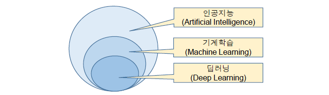
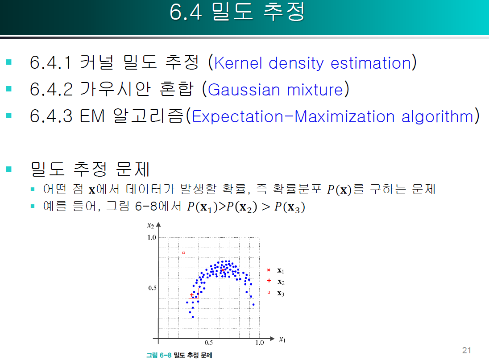

# machineLearning
2022-1 Machine Learning

# 중간 - 기계학습

복습: No
작성일시: 2022년 3월 1일 오후 2:30

[중간 관련 정리](https://www.notion.so/e16dfb63dceb482f855f2a926cab7f28)

- 1주차
    
    # 1주차 22.03.03
    
    ### 기계학습 정의
    
    경험을 통해 점점 성능이 좋아지는 기계를 만드는 것.
    
    → 어떤 컴퓨터 프로그램이 T라는 작업을 수행할 때, 이것의 성능을 P라는 척도로 평가했을 때 경험을 E를 통해 성능이 개선된다면 이 프로그램은 학습한다고 말할 수 있다.
    
    
    
    ### 지식기반 방식에서 기계학습으로의 대전환
    
    전통적으로 지식기반 방식이 주류
    
    지각(Perception)의 문제에서 발생
    
    
    
    f3는 정확도가 높다.
    
    예측 문제
    
    - 회귀(regression) 문제 : 목표치의 실수값
    - 분류(classification) 문제 : 부류의 값
    
    ### 훈련집합
    
    
    
    가로축은 특징, 세로축은 목표치
    
    관측한 4개의 점이 훈련집합을 구성함.
    
    ### 데이터를 어떻게 모델링할 것인가?
    
    
    
    y = wx + b
    
    기계 학습은 가장 정확하게 예측할 수 있는, 최적의 매개변수를 찾는 작업.
    
    ### 기계 학습의 궁극적인 목표
    
    - **훈련집합에 없는 새로운 샘플에 대해 오류를 최소화**
    - **테스트 집합에 대한 높은 성능을 일반화 능력이라고 부름**
    
    훈련 데이터에 없는 샘플에 대해서도 오류를 최소화 해야함!
    
    학습 양이 데이터에 비해 지나치게 많을 경우.
    
    → 학습 데이터는 잘 설명하지만 테스트 데이터에 대해서는 잘 설명하지 못함.
    
    **→이것을 overfit 과적합 되었다고 함.**
    
    기계학습에서는 수학의 의존도가 높다.
    
    ### 1차원과 2차원 특징 공간
    
    
    
    ### 다차원 특징 공간
    
    
    
    
    
    선형 모델을 사용하는 경우 매개변수 수는 d차원일 때 **d+1**
    
    **2차 곡선 모델이라면?**
    
    d=4이므로 21개의 매개변수
    
    매개변수 수  = **d^2+d+1** 개
    
    (xi*xj와 xj*xi를 구분할 때임)
    
- 2주차
    
    # 2주차 22/03/08
    
    
    
    선을 그어도 정확률이 75프로 밖에 안됨.
    
    **선형 분리 불가능한 원래 특징 공간을 특징공간 변환을 통해 100% 정확률을 갖는 선형 모델 찾을 수 있다**
    
    
    
    기존 특징 벡터를 어떤 방식에 의해서 변환을 하여 다른 특징 공간으로 변환
    
    ### 표현 학습
    
    - 좋은 특징 공간을 자동으로 찾는 작업
    - 원래 있던 공간에서 있던 데이터를 다른 방식으로 표현하는 방법 배우는 것
    
    
    
    차원의 저주
    
    - 차원이 높아짐에 따라 발생하는 현실적인 문제
    
    
    
    데이터 수집 → 모델 정립 → 예측 과정을 반복
    
    
    
    이런 상황에서는 x를 알면 y값을 정확히 예측 가능
    
    확률 분포 P(x)를 정확히 알 수 있음.
    
    
    
    데이터베이스(데이터셋) << 데이터 집합.
    
    
    
    - 꽃받침 길이
    - 꽃받침 너비
    - 꽃잎 길이
    - 꽃잎 너비
    
    위 4가지를 기반하여 4차원 특징 공간이 형성. 목표값은 3종 숫자를 표시함 (3종류의 꽃중에 하나)
    
    
    
    필기 숫자 데이터 집합
    
    
    
    관련 단어와 연관된 수천 개의 영상을 수집
    
    
    
    
    
    ### 매니폴드 가정
    
    → 방대한 공간에서 실제 데이터가 발생하는 곳은 매우 작은 부분 공간임
    
    원래 특징 공간보다 낮은 차원에 데이터가 집중되어있다
    
    ## 데이터 가시화
    
    
    
    여러 가지 가시화 기법을 통해 표현 가능
    
    2개씩 조합하여 여러 개의 그래프 그림
    
    
    
    ### 선형 회귀 문제
    
    데이터 특징들의 선형적인 조합으로서 모델을 만드는 것.
    
    기울기와 y축 절편이 모델을 결정함.
    
    f3가 위 그림에서 제일 잘 설명하는 모델.
    
    
    
    ### 목적 함수(비용 함수)
    
    차이들이 얼마나 발생하는지 정량화해서 표현한 것
    
    ### 평균제곱오차
    
    차이를 제곱해서 전체를 더해서 평균
    
    → 모든 데이터가 오차가 없다면 0이 나옴. 0이 가까울 수록 정확도가 높음
    
    
    
    
    
    
    
    기계 학습이 할 일을 공식화하면?
    
    **J라는 목적함수를 최소화 하는 매개변수를 찾고자 함**
    
    argmin은 함수를 최소화 하는 매개변수를 뜻함.
    
    
    
    실제 세계에서 얻을 수 있는 데이터는 비선형 모델
    
    
    
    ### 과소적합(underfit)
    
    → 모델의 용량이 작아 오차가 클 수밖에 없는 현상
    
    오차가 훈련 데이터에 대해서 굉장히 줄어들 수 있는 모델을 만들 수 있음.
    
    
    
    ### 과잉적합(Overfit)
    
    → 용량이 크기 때문에 학습 과정에서 잡음까지 수용
    
    훈련 집합에 대해서는 거의 완벽하지만 새로운 데이터를 예측한다면 큰 문제 발생
    
    
    
    1~2차는 훈련집합과 테스트집합 모두 낮음
    
    12차는 훈련집합에 높은성능, 테스트집합에서는 낮은 성능
    
    3~4차는 훈련집합에 대해서는 12차보다 낮지만, 테스트집합에서는 높은 성능
    
    
    
    ### 바이어스(편향)와 분산
    
    2차는 매번 큰 오차 → 바이어스가 큼 → 하지만 비슷한 모델을 얻음 → 낮은 분산(모델끼리 차이 x)
    
    12차 매번 작은 오차 → 바이어스가 작음(실제 목표값과의 차이) → 하지만 크게 다른 모델을 얻음 → 높은 분산
    
    일반적으로 용량이 작은 모델
    
    - 바이어스는 크고, 분산은 작음
    
    복잡한 모델은
    
    - 바이어스는 작고, 분산은 큼
    
    ### 이것을 바이어스와 분산은 트레이드오프 관계라고 부름
    
    # 이 부분 잘 기억해두시길 바랍니다.
    
    
    
    ### 기계 학습의 목표
    
    낮은 바이어스와 낮은 분산을 가진 예측기 제작이 목표
    
    바이어스의 희생을 최소로 유지하며 분산을 최대로 낮추는 전략
    
    
    
    ### 검증집합 : 검증데이터 셋을 확보를 할 수 있는 경우, 데이터가 충분히 많은 경우
    
    훈련집합과 테스트집합과 다른 별도의 검증집합을 가진 상황
    
    
    
    ### 교차 검증 : 비용상의 문제로 검증집합을 만들 수 없는 상태라면
    
    훈련집합 전체를 일정한 크기로 등분함.
    
    k번을 반복하면 모델이 k개 만들어지고 검증 성능이 나오고, 이것으로 모델 성능을 측정함.
    
    
    
    ### 부트스트랩 : 훈련 데이터 일부를 실제 훈련에 사용하고 나머지를 검증에 사용하는 방법
    
    일정한 k로 나누는 것이 아닌, 난수를 이용하여 랜덤하게 샘플링을 한다.
    
    
    
    현실에서는 아주 다양함.
    
    ### 현실에서는 경험으로 큰 틀 선택한 후 → 모델 선택 알고리즘으로 세부 모델 선택하는 전략 사용
    
    
    
    과잉적합이 생기지 않도록 용량이 충분히 큰 모델 선택한 후, 선택한 모델이 정상을 벗어나지 않도록 여러 가지 규제 기법을 적용.
    
    
    
    ### 데이터 확대
    
    데이터를 더 많이 수집하면 일반화 능력이 향상됨.
    
    
    
    데이터 수집은 많은 비용이 든다.
    
    - 사람이 일일이 레이블링 해야 함
    
    인위적으로 데이터 확대
    
    - 훈련집합에 있는 샘플을 변형함
    - 약간 회전 또는 와핑(부류 소속이 변하지 않게)
    
    
    
    ### 가중치 감쇠
    
    가중치 부분을 작게 해야 함. ex) 1005.7이 너무 커서 x의 조그마한 변화에도 값이 확 바껴서 overfit 발생
    
    규제항을 하나 만들어줌으로써 가중치를 작게 만든다.
    
    
    
    ### 지도 학습 : 특징 벡터가 있고 Y가 모두 주어진 상황. 회귀와 분류 문제로 구분
    
    ### 비지도 학습 : 특징 벡터는 있는데 목표값 Y가 주어지지 않은 상황
    
    - 군집화 과업
    - 밀도 추정
    - 특징 공간 변환 과업
    
    
    
    ### 강화 학습 : 목표값이 주어지는데, 지도 학습과 다른 형태
    
    - 게임을 구성한 샘플들 각각에 목표값을 나눠줘야 함
    
    ### 준지도 학습 : 일부는 X와 Y를 가지지만 나머지는 X만 가진 상황
    
    
    
    ### 오프라인 학습과 온라인 학습
    
    새롭게 추가되는 샘플에 대해서 학습
    
    ### 여러가지 방법들이 있다?
    
    ## 인공지능의 역사
    
    관심있으면 읽어보세요
    
    
    
    # 2주차 22/03/10
    
    
    
    기계 학습에서의 수학의 역할
    
    - 목적 함수를 정의
    - 최적화 이론
    
    
    
    
    
    **샘플을 특징 벡터(열 벡티)로 표현함**
    
    
    
    ### 설게 행렬
    
    데이터 n개의 행을 가지는 행렬을 일컫는 말
    
    
    
    ### 전치 행렬 → 행과 열이 서로 바뀌어진 행렬이다
    
    
    
    # 다항식 행렬 표현 복습하기
    
    
    
    # \행렬의 연산 복습하기
    
    
    
    ### 텐서
    
    3차원 이상의 다차원 배열의 구조를 말함
    
    
    
    ### 놈 : 벡터와 행렬의 크기를 측정
    
    ### 프로베니우스 놈 : 각 값을 모두 제곱하고 루트를 씌우는 것.
    
    
    
    # 삼각함수 특수각 공부하기
    
    
    
    쓰레쉬홀드보다 크냐 작냐를 비교하여 값을 계산하는 구조
    
    이것을 쭉 연결해놓은 것이 신경망
    
    계단 함수는 입력을 구분해서 출력을 내보낸다.
    
    
    
    ### 결정 직선 : 공간 자체를 분리해주는 직선
    
    퍼셉트론이 이것을 정한다. EX) 파란선 위는 + 파란선 밑은 -
    
    
    
    C행 D열의 전체 가중치 벡터 집합이 표현될 수 있다?
    
    
    
    ### 분류라는 과업 : 활성함수에 Wx 값을 넣는 것
    
    ### 학습이라는 과업 : o값과 x값을 통해 W를 찾는 것.
    
    
    
    선형결합을 통해서 다른 벡터를 만들어낼 수 있다.
    
    2개의 기저 벡터를 통해 **벡터공간**을 만들 수 있다.
    
    
    
    # 역행렬 계산하는 법 공부하기
    
    
    
    
    
    # 행렬식 계산하는 법
    
    2차원에서는 2개의 행 벡터가 이루는 평행사변형의 넓이
    
    3차원에서는 3개의 행벡터가 이루는 평행사각기둥의 부피
    
    
    
    ### 정부호 행렬
    
    # 정부호 행렬 개념 공부 다시하기
    
    방향이 양수쪽으로 가게 되는 것,  positive
    
    방향이 음수쪽으로 가게 되는 것, negative
    
    선형 변환된 벡터가 원래의 벡터가 방향이 90도 이상 차이나지 않는다.
    
- 3주차
    
    # 3주차 22/03/14
    
    
    
    행렬에서도 분해를 사용한다
    
    - 고유값 아이겐 벨류
    - 고유벡터 아이겐 벡터
    
     
    
    
    
    행렬에 벡터가 곱해지면 벡터에 선형변환을 해주는 것임. 방향이 바뀔 수도 있음
    
    고유 벡터는 방향이 바뀌지 않는 것임.
    
    파란색인 원이 있고, 빨간 타원형
    
    파란색 위에 존재하는 모든 점은 빨간 타원에 있는 점으로 모두 변환이 가능하다.
    
    [머신러닝 - 19. 고유값(eigenvalue), 고유벡터(eigenvector), 고유값 분해(eigen decomposition)](https://bkshin.tistory.com/entry/%EB%A8%B8%EC%8B%A0%EB%9F%AC%EB%8B%9D-19-%ED%96%89%EB%A0%AC)
    
    
    
    
    
    ### 직사각형 행렬일 때 특잇값 분해 SVD
    
    ## 확률과 통계
    
    
    
    확률 변수 x의 정의역은 {도, 개, 걸, 윷, 모}
    
    
    
    확률 밀도 함수를 통해서 확률을 나타낸다.
    
    
    
    ### 확률 실험
    
    카드를 뽑은 뒤 해당 번호에 뽑힌 병에서 공을 하나 뽑음.
    
    번호를 y라는 확률 변수
    
    공의 색을 x라는 확률 변수
    
    
    
    ### 확률의 곱 규칙과 합 규칙
    
    
    
    ### 베이즈 정리
    
    
    
    
    
    
    
    주머니의 병의 일부가 가려져 있는 상황?
    
    a : p1, p2, (1-p1-p2)
    
    b : q3, (1-q3)
    
    
    
    
    
    벡터의 분산인 경우에는 확률 변수가 여러개 있기 때문에, 개별적인 분산이 있고 공분산도 있다.
    
    u가 평균 벡터
    
    시그마가 공분산
    
    
    
    
    
    ### 가우시안 확률 분포 → 정규 분포
    
    
    
    ### 베르누이 분포 : ex 동전 던지기
    
    
    
    ### 정보이론 : 확률이 작을 수록 많은 정보?
    
    정보의 양은 : 불확실성을 줄이는 크기
    
    ### 엔트로피 : 확률 변수 x의 불확실성을 나타내는 엔트로피
    
    
    
    엔트로피 계산
    
    윷 : 2.0 비트
    
    주사위 : 2.5 비트
    
    주사위는 모든 면의 확률이 동일하게 6분의1임
    
    윷은 경우의 수가 조금 다름.
    
    **균일하게 다 같은 경우가 무질서도가 높기 때문에 엔트로피가 높다**
    
    
    
    기계학습에서 학습 모델의 오차를 측정하는 목적 함수에 많이 사용됨.
    
    값이 너무 작아져서 0이 될 수도 있기 때문에 log를 붙임
    
    
    
    ### KL 다이버전스
    
    P와 Q가 같다면 0이 된다.
    
    두 확률 분포의 엔트로피 차이를 계산한 값임.
    
    두 확률 분포 사이의 거리를 계산할 때 주로 사용한다.
    
    
    
    # 3주차 22/03/17
    
    ### 최적화
    
    
    
    최적화 할 수 있는 목적 함수
    
    최소의 값에 도달하게 하는
    
    → 미분을 하는 것.
    
    어떻게 하면 목적 함수가 최소가 될 수 있을지?
    
    스토캐스틱 경사하강법
    
    
    
    목적 함수를 어떤 식으로 정하느냐에 따라서 최적화가 가능하다.
    
    도함수를 구해서 0
    
    - 선형회귀는 목적함수가 정해짐.
    - 퍼셉트론 : 맞는냐 틀리느냐에 따라서 오차가 나오게끔.
    - 딥러닝은 퍼셉트론 여러 층을 형성해서 최적 가중치를 찾음
    
    특징 공간에 크기가 있을 것임.
    
    매개 변수들이 특징 공간에 비해서 훨씬 많은 경우
    
    
    
    수십만 수백만 차이의 공간
    
    전역 최적해 전역 최솟값
    
    전역 최적해에 가까운 지역 최적해를 찾고 끝내는 경우가 많음.
    
    EX) 목적함수를 최소로 하는 최적해를 찾아라?
    
    
    
    낱낱 탐색 : 가능한 해를 모두 생성하여 집합에 저장
    
    무작위 탐색 : 무작위로 해를 생성함
    
    
    
    ### 경사 하강법
    
    작아지는 위치로 갈 수 있도록 하는 방법을 사용하는 것.
    
    미분을 써서 찾자
    
    방향을 구하는 것이 문제가 될텐데 이때 미분을 사용한다.
    
    
    
    1차 도함수
    
    2차 도함수
    
    함수의 기울기에 해당하는 개념이다
    
    도함수 값을 빼면 
    
    
    
    각 변수의 축방향의 미분 결과가 나오는데 이것이 편미분
    
    매개변수 집합 세타에 많은 변수가 있으므로 편미분을 많이 사용
    
    델 기호 / 델타 기호로 표기함 / 2개의 독립변수를 가지는 경우 편미분한 것을 결과로 가지는 것.
    
    x2는 상수라고 보고 미분하면 된다.
    
    → 이것이 편미분
    
    예제 2-10
    
    1. 2차원 매개변수 공간에서의 제일 작은 값을 찾으려고 하는 것임
    2. 그림은 3차원 공간 점(x0)처럼 그려놨는데 잘못된 것임. 
    
    
    
    1. 초기점을 어디로 시작했느냐에 따라서
    2. 바닥에 화살표를 따라가면 제일 크게 F의 값이 증가
    3. 그렇기 때문에 그레이디언트의 반대 방향으로 가면
    4. 전체 함수가 빨리 작아지는 쪽으로 갈 수 있다.
    
    
    
    최적화를 하는 것은 예측 단계가 아니라 학습 단계에 필요
    
    
    
    함수의 결과값을 다른 함수에 입력하기도 한다.
    
    
    
    - 야코비언 행렬 :
        - 1열은 x1으로 편미분
        - 2열은 x2으로 편미분
    - 헤시안 행렬 :
        - 행하고 열의 수가 같음.
        - 각각의 변수로서 편미분을 다시 함?
        - 1행1열은 x1에 대해서 편미분 한 것을 다시 x1에 대해 편미분
        - 1행 2열은 x1에 대해 편미분 한 것을 다시 x2에 대해 편미분
    
    
    
    그레이디언트를 구해서 더해주는데 그것을 네거티브 방향으로 가면서 + 학습률 p를 곱해줌으로써 얼마만큼 네거티브 그레이디언트를 반영할지?
    
    Batch : 일괄처리 방식
    
    전체 데이터에 대해서 전부 다.
    
    
    
    스토캐스틱 경사하강 알고리즘 SDG : 하나하나 할 때마다 그대로 매개 변수에 반영을 하자.
    
    하나의 샘플의 그레이디언트를 계산했을 때 그것을 그대로 업데이트 하자.
    
    각각에 대해서 바로 반영.
    
    - 배치는 모든 그레이디언트를 다 구해서 평균을 내는 것.
    - 스토캐스틱은 : n개의 샘플이 있다면 n번 반복되어 샘플 하나하나 업데이트.
    
    미니배치 스토캐스틱 경사 하강법 : 위 2개를 섞어서 극단적인 것이 아니라 중간 정도하는 것.
    
    # 책에 있는 연습문제를 푸는 과제
    
    ## 1장 : 1, 2, 4
    
    ## 2장 : 7, 9, 11, 14
    
    **다음주에 제출 3월24일 목요일까지**
    
    기계학습 - 오일석 - 한빛아카데미
    
    # 3장 다층 퍼셉트론
    
    
    
    
    
    사람의 뉴런을 본떠서 만들었다.
    
    
    
    사이클이 없는 것은 전방 신경망 
    
    사이클이 존재하는 것은 순환 신경망
    
    층을 쌓은 정도에 따라서 얇은 신경망과 깊은 신경망
    
    
    
    ### 퍼셉트론
    
    
    
    입력이 있고 출력이 있음.
    
    가중치에 의해 입력을 받아들이고 그 가중치의 합이 쓰레쉬 홀드를 넘는지 안 넘는지에 따라서 달라지는 구조.
    
- 4주차
    
    # 4주차 22/03/22 화
    
    
    
    특정값과 가중치를 곱한 결과를 모두 더하여 s를 구하고, 활성함수 타우를 적용함.
    
    퍼셉트론은 활성 함수가 계단 함수임.
    
    
    
    두개의 논리 변수 x1, x2 외 상수항 x0 = 1을 가진다.
    
    쓰레쉬 홀드
    
    
    
    식 3.4는 행렬의 곱셈 형태로 표현한 것임.
    
    
    
    결정 직선을 정의한다.
    
    가중치 벡터와 직교하는 직선이고, 원점에서 수직선을 내렸을 때 그 거리가 임계치 나누기 가중치 벡터 크기가 된다.
    
    
    
    퍼셉트론을 학습시킨다는 것은 퍼셉트론의 입력 벡터에 대해서 올바른 값을 출력할 수 있도록 매개 변수를 학습하게 한다.
    
    
    
    현재 퍼셉트론이 출력이 잘되는지 평가하는 방법
    
    목적함수 == 손실함수 == 비용함수
    
    **퍼셉트론에서 가중치가 매개변수가 됨.**
    
    목적함수는 현재의 가중치로 출력이 결정되기 때문에 매개변수를 독립변수로 하는 함수로서 표현 가능
    
    목적 함수의 조건
    
    1. J(w) ≥ 0
    2. w가 최적이면 J(w) = 0 손실 비용이 0이다.
    3. 틀리는 샘플이 많을 수록 j(w)는 큰 값을 가진다.
    
    
    
    목적함수를 정의했다면 경사하강 법을 이용해서 목적함수가 최소가 되는 매개변수 w를 찾을 것임.
    
    경사 하강법을 적용하는 과정에서 그레이디언트를 계산
    
    현재에 있는 매개변수에 반대 방향으로 즉 -g 방향으로 더 해준다.
    
    wi에 대해서 편 미분을 하게 되면 시그마 -ykxki가 나옴 이것이 g가 됨.
    
    로우라는 학습률을 그레이디언트에 곱하고 그것에 반대방향인 -
    
    wi = wi + 로우*g (-와 -가 만나서 +가 됨)
    
    
    
    학습과정은 훈련과정에 있는 모든 샘플을 맞출 때까지 훈련 데이터를 반복적으로 제공함.
    
    여러 세대를 반복함.
    
    **퍼셉트론 학습**
    
    **배치 버전 : 가중치를 갱신하는 과정이 전체 데이터 스캔 하고 나서 일어나는 것.**
    
    **스토케스틱 버전 : 개개인의 훈련 샘플 하나하나 당 가중치 업데이트**
    
    공집합이 아니란 이야기는 틀린 데이터라는 이야기
    
    틀리게 되면, 실제 가중치를 업데이트 해준다
    
    위 과정을 공집합이 없을 때까지 반복.
    
    그리고 반복이 끝나고 최종적으로 나온 w를 반환하고 끝내게 됨.
    
    
    
    스토캐스틱 방식 : 각 개별 샘플에 대해서 출력 계산을 하고 이 가중치 벡터를 바로 계산하는 방식
    
    
    
     가중치 요소 별로 하나씩 하나씩 업데이트
    
    행렬 표기하여 간결하게 표기할 수 있다.
    
    틀린 것이 없을 때까지.
    
    ### 선형분리 불가능한 경우에는 이 과정을 무한반복함.
    
    그러므로 ‘더 이상 개선이 없다면’이라는 조건으로 수정해야 함.
    
     
    
    
    
    다층 퍼셉트론
    
    입력 특징들을 다른 특징공간으로 변환 해주는 은닉층이라는 것을 사용.
    
    
    
    퍼셉트론은 선형 분류기라는 한계.
    
    하나의 직선으로서 2분할 수 있는 방법이 없다면 퍼셉트론은 100% 정확도를 갖지 못함.
    
    
    
    - 은닉층을 통해 새로운 특징 공간으로 분류함.
    - 다층 퍼셉트론에서는 시그모이드 활성함수를 사용하여 연속적인 출력값이 나올 수 있음.
    - 오류 역전파 알고리즘 : 층별 가중치 갱신 방식이 도입된 점.
    
    
    
    퍼셉트론 2개를 사용하여 XOR 문제 해결
    
    퍼셉트론 1과 퍼셉트론 2가 모두 +1이면 검은점 부류
    
    
    
    위 퍼셉트론 2개를 병렬로 결합하면 그림 3-9처럼 됨.
    
    
    
    2개의 출력을 받아서 입력으로 사용하는 퍼셉트론을 만들면 다층 퍼셉트론이 된다.
    
    
    
    3개의 출력 노드를 갖는 병렬 퍼셉트론의 구조
    
    
    
    사용하는 활성 함수에도 변화가 일어남.
    
    단층 퍼셉트론 → 계단 함수
    
    다중 퍼셉트론 : 곡선 모양의 부드러운 의사결정
    
    - 로지스틱 시그모이드
    - 하이퍼볼릭 탄젠트 시그모이드
    
    
    
    여러 가지 활성 함수들
    
    다층 퍼셉트론이 등장하면서 S모형의 활성함수들이 도입됨.
    
    
    
    훈련 데이터들의 특징의 갯수를 d라고 한다면
    
    → d+1개의 입력 노드
    
    부류 개수가 c라고 한다면
    
    → c개의 출력 노드
    
    p 하이퍼 매개 변수 : 중간에 있는 출력노드 전부(사용자가 정해주는 매개 변수)
    
    - p를 너무 크면 설정해줘야할 가중치가 많아서 과잉 적합.
    - p를 너무 작으면 데이터를 잘 설명 못하는 과소 적합.
    
    가중치 벡터들을 행으로 하는 행렬을 생각할 수 있다.
    
    각 벡터가 하나하나의 행으로 하는 행렬
    
    
    
    출력 1층에 p개만큼 파란 점들이 있으니까, p개의 행을 갖게 됨.
    
    다음 층의 입력은 전 층에 있는 노드 갯수 x1 ~ xd에 갯수 +1만큼을 갖게됨. 바이어스 항이 1개 있기 때문에 +1을 해줌.
    
    - ex) u1pd는 1층에 xd노드에서 나와서 p노드로 간 것.
    
    입력층을 0번째 은닉층
    
    출력층을 마지막 은닉층
    
    
    
    - 특징 벡터 x를 출력 벡터 o로 매핑하는 함수로 간주할 수 있음.
    
    
    
    각각의 노드에서 어떻게 연산이 이루어져아하는지
    
    j번째 은닉 노드 연산
    
    가중치 곱의 합 ux 행렬곱의 형태
    
    전층에서 나오는 출력값들을 가중치에 곱해서 또 타우(활성함수)를 적용해서 아웃풋을 구함.
    
    
    
    다층 퍼셉트론을 어떻게 훈련을 시킬 것인가?
    
    은닉층이라는 것은 특징 공간의 변환해주는 역할
    
    은닉층이 다층 퍼셉트론에서 하는 역할은 특징을 추출하는 역할.
    
    # 4주차 22/03/24
    
    
    
    다층 퍼셉트론을 학습시키기 위한 알고리즘에 대해서 알아봄.
    
    
    
    다층 퍼셉트론에서 살펴볼 수 있는 목적 함수
    
    입력 값을 받아서 출력값을 내보냄.
    
    **오차의 크기 값을 계산하는 함수**
    
    ### → 손실함수, 목적함수
    
    ### 기계학습의 목표
    
    모든 샘플을 옳게 분류하는 함수 f를 찾는 일
    
    
    
    각 오차를 제곱함.
    
    - 온라인 모드 : 각 개개인의 데이터 하나하나 마다 발생하는 오차를 바탕으로 필요한 매개 변수를 업데이트
    - 배치 모드 : 많은 데이터들을 고려해서 오차에 제곱을 구해서 평균을 구함.
    
    각 다이어그램으로 표현 가능함.
    
     
    
    
    
    ### 목적 함수가 최소가 되게 하는 알고리즘인 오류 역전파 알고리즘
    
    다층 퍼셉트론인 경우 목적 함수에서 사용된 매개변수는 가중치 집합 데이터 매개 변수로 볼 수 있음.
    
    (원래 나와야 하는 출력 - 퍼셉트론에서 나온 출력)에 제곱한 것을 목적함수라고 하자.
    
    **목적 함수가 어디에서 최소가 되는지 찾는 것 → 경사하강법**
    
    
    
    다중퍼셉트론이 개개인의 데이터 하나하나를 업데이트 하는 식으로 경사하강법을 쓰는 알고리즘.
    
    1. U1, U2 랜덤하게 설정을 한다.
    2. X를 섞는다.(인위성 없앤다.)
    3. 편미분 한 행렬 식을 구한다.
    4. U1, U2를 계속 갱신한다.
    5. 멈춤 조건이 만족될 때까지 계속 진행한다.
    
    
    
    목적함수를 U1, U2로 편미분한 결과. 즉, 그레이디언트 행렬들
    
    편미분을 하면 K인 경우만 남게 된다.
    
    
    
    1층에 있는 가중치 하나가 최종적인 J에 어떤 영향을 미치는지 J를 최종 출력으로 편미분한 값을 계산해보자
    
    오류 역전파 알고리즘
    
    → 출력을 계산할 때 방향과 반대로 전파를 하면서 그레이디언트를 계산하는 알고리즘
    
    
    
    개개인의 원소 입장에서 어떻게 업데이트 되어야할지?
    
    
    
    랜덤 샘플링 방식
    
    
    
    
    
    ### 미니 배치 스토캐스틱 경사 하강법
    
    - 배치 버전
    - 스토캐스틱 버전
    
    두 버전의 중간 버전
    
    일반적인 중간 크기 데이터를 정해서 그것을 업데이트 하는 식
    
    중간 크기 데이터를 미니 배치라고 부름.
    
    
    
    ### 전체 데이터 수는 N, 매개변수를 업데이트 하기 전에 처리하는 샘플 수를 T
    
    - T가 1이면 스토캐스틱 경사 하강법
    - T가 N이면 전체 데이터이기 때문에 배치 경사 하강법
    
    미니배치 방식은 보통 T= 수십~수백
    
    - 그레이디언트의 잡음을 줄여주는 효과 때문에 수렴이 빨라짐
    - GPU를 사용한 병렬처리에도 유리함.
    
    
    
    배치버전과 동일하게 멈춤 조건이 나올 때까지 반복한다라는 것은 동일
    
    하지만 전체 데이터를 다 처리하고 가중치를 업데이트 하는 방식은 아님. 전체 데이터 중에 T개의 샘플 무작위로 뽑아서 미니 배치를 구성을 함. 그것을 가지고 반복을 함.
    
    
    
    
    
    
    
    굉장히 빠른 속도로 값을 처리할 수 있다.
    
    시간 복잡도는 다음과 같이 나온다.
    
    
    
    다층 퍼셉트론은 이론적으로 모든 함수를 정확하게 근사할 수 있는 능력.
    
    은닉층의 노드 수를 무수히 많게 할 수는 없으므로, 실질적으로 복잡한 구조의 데이터에서는 성능 한계
    
    
    
    - 아키텍쳐 : 은닉층이 많으면 과잉적합, 은닉층이 적으면 과소적합이 될 수 있다. 일반적으로는 복잡한 모델을 사용하되, 적절한 규제 기법을 사용해야한다.
    - 초깃값 : 난수 생성, 값의 범위와 분포
    - 학습률 : 동일한 학습률이 아니라, 상황에 따라서 값을 바꿔나감.
    - 활성함수 : 다른 활성 함수들을 사용한다.
    
    
    
    층을 높게 쌓으면 학습하기 어려워짐.
    
    ## 오류 역전파 개념 다시 리마인드 하시길
    
- 5주차
    
    # 5주차 22/03/29
    
    ### 딥러닝 기초
    
    
    
    - 깊은 신경망을 이용해서 학습시키는 것.
    - 은닉층을 여러 개 추가하면 깊은 신경망이 됨.
    
    
    
    
    
    - 새로운 활성함수 사용
    - 규제 기법 영향
    - 학습률을 적응적으로 만든다던지
    
    
    
    - 하드웨어적인 성능 향상
    - 사용할 수 있는 학습 데이터가 많아져서 훌륭한 성능 모델들
    
    → 딥러닝 기술이 다양한 분야에 적용됨
    
    
    
    - 고전적 패러다임
        - 특징 벡터가 어떻게 만들어졌는지 전혀 관여하지 않음
        - 특징 벡터 그대로를 학습함. 그래서 제대로 학습하지 못함.
        - 특징 추출을 사람이 수동적으로 관여
    - 딥러닝에서의 특징 학습
        - **특징학습 : 신경망에 의해서 특징 추출이 자동으로 이루어진다.**
        - **통째학습 : 원래 패턴이 신경망에 입력**
    
    
    
    은닉층에서 저급 특징에서 고급 특징으로 특징 추출 가능.
    
    ### 깊은 다층 퍼셉트론
    
    
    
    DMLP
    
    - 3층 이상의 구조
    - 은닉층 + 출력층 수 합한 것이 3층이상 것.
    
    **표기방법 잘 기억하기 U(L-1,rq)**
    
    
    
    - DMLP의 가중치 행렬
    - DMLP의 동작
        - 함수들이 계속 합성됨.
    
    
    
    - MLP와 동작 동일함.
    
    
    
    
    
    - 한층에서 연산하는 것과 동일한 방식
    - 차이는 여러 은닉층의 역전파 하는 것을 for문으로 계산해줌
    
    
    
    - **퍼셉트론 : 퍼셉트론 → 다층 퍼셉트론 → 깊은 다층 퍼셉트론**
    - **활성함수 : 계단함수 → 시그모이드함수 → ReLU와 변형들**
    - **목적함수 : 평균제곱오차 → 평균제곱오차 → 교차 엔트로피 또는 로그우도**
    
    
    
    ### CNN(컨볼루션 신경망 Convolutional neural network)
    
    동물의 시각피질에 영감
    
    어떤 층에 있는 세포는 전 층에 있는 일부 세포에 대해서만 반응을 하는데 이것들을
    
    수용장 Receptive filed라고 부름
    
    DMLP는 완전연결 구조임.
    
    CNN은 부분 연결 구조임.
    
    
    
    ### 컨볼루션 : 하나의 연산을 의미
    
    컨볼루션은 해당하는 요소끼리 곱하고 결과를 모두 더하는 선형 연산.
    
    1차원 입력은 내적을 의미
    
    2차원 입력은 해당되는 연산끼리 서로 곱해서 연산
    
    U(x)가 커널, 커널의 가운데를 중심으로 -1 0 +1 잡음
    
    0.3 + 8 + 0.6 = 8.9
    
    2차원에서도 각각 대응되는 것에 컨볼루션 → 21 계산됨
    
    
    
    컨볼루션에서 커널을 적용해서 얻어진 출력은 원래 입력보다 작아짐.
    
    출력이 입력에 비해 줄어드는 것을 막기 위해서 값을 더해주는 것을 덧대기(Padding)이라고 함
    
    - 0패딩 : 0을 추가.
    - copy패딩 : 가장자리 값 복사해서 더 두꺼워짐
    
    **바이어스 추가**
    
    추가된 값에 대해서는 1로 연산을 함
    
    
    
    컨볼루션 연산이 신경망 형태로 표현된다면?
    
    
    
    컨볼루션
    
    커널은 어떤 특징을 찾아낼 때 사용하는 것.
    
    3개의 커널로 3개의 특징 맵을 추출
    
    
    
    ### 컨볼루션 특징 학습
    
    - 커널을 사람이 설계하지 않고, 학습으로 알아냄
    - 2차원 영상이 7*7 커널을 64개를 사용한다면
        - (7*7+1)*64 = 3200개 매개 변수를 찾아내야 함.
    
    
    
    - 이동 동변성
    - 원래 입력에 있는 데이터 어떤 것을 먼저 하더라도 결과는 같을 수 있다.
    - 이동하고 컨볼루션하나, 컨볼루션하고 이동하나 동일함
    
    병렬 분산 연산을 지원한다.
    
    - 각각의 노드가 독립적으로 연산을 하기 때문에. 병렬 구조
    - 층을 거치면서 전체에 영향을 미치기 때문에. 분산 구조
    
    
    
    특징 맵의 크기를 더 줄이는 경우도 있다.
    
    - 다운샘플링
    
    보폭을 2로 설정하여 컨볼루션을 한다.
    
    
    
    - 실제로 2차원의 이미지는 3차원의 텐서로 표현이 될 수 있음.
    
    
    
    - 3차원 구조의 데이터에 적용
    - 직육면체 구조로 표현을 함.
    
    
    
    ### 풀링 연산 : 앞에 층에서 들어온 입력에 대해 요약하거나 통계를 추출하는 연산
    
    그림1) 연결되어있는 것들 중에 제일 큰값.
    
    그림2) 보폭을 2로 하면 이렇게 됨.
    
    입력의 작은 변화에 둔감하게 작용함.
    
    풀링 연산의 특성
    
    - 요약통계 정보를 갖는다.
    - 가중치에 해당하는 부분이 따로 없음.
    - 컨볼루션 연산을 하지 않음. 학습을 할 것도 없다.
    - 특징 맵의 수를 그대로 유지함.
    - 작은 이동에 둔감하다.
    
    
    
    CNN은 빌딩을 여러층 쌓아서 깊은 구조를 만듦.
    
    컨볼루션 층과 풀링층
    
    
    
    ### 초창기 CNN 사례 LeNet-5
    
    CNN 구조를 취하고 있음. 앞에 몇층은 특징을 추출함.
    
    특징 추출 단계에서 컨볼루션 풀링 연산이 번갈아가면서 됨.
    
    # 5주차 22/03/31
    
    
    
    
    
    1순위 오류율 : 제일 가능성 높은 다 맞춘 거
    
    5순위 오류율 : 제일 가능성 높은 거 다 틀린 거
    
    
    
    ### AlexNet
    
    컨볼루션층 5개와 완전연결층 3개
    
    
    
    - 할성함수로 ReLU 사용
    - 지역 반응 정규화 기법 적용
    - 과잉적합 방지하는 여러 규제 기법 적용
    
    
    
    ### 준우승 한 모델
    
    버전에 따라 컨볼루션 층 8~16개 두어 AlexNet의 5개에 비해 2~3배 더 깊어짐.
    
    VGG-16 : 컨볼루션 층 13층 + FC 3층
    
    VGG-19 : 컨볼루션 층 16층 + FC 3층
    
    VGGNet
    
    
    
    - 1*1 커널 한층에 대해서만 적용
    - 전체적으로 차원을 축소할 수 있는 효과를 얻을 수 잇음.
    - 1개에 대해 4개의 커널을 적용하면 1*1*4를 얻을 수 있음.
    - 8*m*n 텐서에 8*1*1 커널 4개를 적용하여 4*m*n 텐서를 출력할 수 있다.
    
    
    
    ### GoogLeNet
    
    구글넷 : 인셉션 모듈 9개 층. 인셉션 모듈이 가장 핵심적인 역할을 함.
    
    
    
    VGGNet의 완전연결 VS NIN의 전역 평균 풀링
    
    VGGNet
    
    - 매개변수 수 : 7*7*512 * 4096, 4096*4096, 1000 * 4096
    - 과잉적합의 원인
    
    NIN의 전역 풀링
    
    - 한 피쳐 맵에 대해서 평균을 내서 사용.
    - 매개변수를 많이 줄일 수 있다.
    
    
    
    - MLPconv 대신 네 종류의 컨볼루션 연산 사용
    - 각각이 만들어내는 특징 맵 수가 다르다.
    
    
    
    - 구글맵은 인샙션 모듈들 9개를 결합하여 가지고 있음
    - 전체 층은 27개, 매개변수가 있는 층 22개, 없는 층 5개
    - 100백만개이기 때문에 VGGNet에 비하여 1%밖에 안된다.
    
    
    
    ### ResNet
    
    125층이 되는 구조
    
    - 잔류학습이라는 아이디어를 이용하여 성능저하를 피하면서 층 수를 늘림
    - F(x) + x를 활성함수 타우에 적용.
    
    
    
    ### 지름길을 연결하는 이유?
    
    - 그레이디언트 소멸 문제 해결
    - 34층짜리 ResNet
    - 빨간색 선이 지름길
    - VGGNet과 동일한 점
        - 3*3 커널 사용
    - VGGNet과 다른 점
        - 잔류 학습 사용
        - 전역 평균 풀링 사용(FC층 제거)
        - 배치 정규화 적용
    
    
    
    - 분류 문제는 성능 포화(사람 성능에 필적)
    - 물체 검출 문제에 집중함.
    
    
    
    ### 생성 모델
    
    
    
    - **MLP와 CNN은 분별 모델, 어떻게 해서 사례가 발생했는지에는 관심 없음. 추정하고 싶은 것은 발생을 했을 때 어떻게 분류를 할 것인지? y 예측**
    - **생성 모델은 입력으로 들어온 특징 벡터 X에 대한 확률 분포를 추정하려고 함.**
    - **생성 모델은 예측 단계에서 구체적인 사례를 생성하는 일을 함.**
    
    
    
    훈련 집합으로 가지고 있는 입력 데이터 x와 y
    
    특징 벡터가 2차원.
    
    - P(x) x가 가질 수 있는 경우의 수 추정
    - P(x|y) y가 가질 수 있는 y가 1인경우 5개가 있는데 그 중에서 (0, 0)인 경우 2개이기에 2/5
    - P(x, y) 결합확률 : 전체 10개 중에 몇개가 있나? y가 0이면서 x가 (0, 0)인 경우 y가 1이면서 00인 경우는 10개 중에 2개이기에 >> 전체 다 합치면 1임
    
    
    
    ### 분별 모델 추정
    
    입력 사례 x가 있을 때 y값을 예측
    
    - x가 0,0인 경우 y가 0인 것 → 0
    - x가 0,0인 경우 y가 1인것 → 2
    - x가 0,1인 경우 y가 0인것 → 1/3
    - x가 0,1인 경우 y가 1인것 → 2/3
    
    
    
    자연계에서 Pdata(x) 데이터 발생 분포
    
    
    
    ### GAN(Generative adversarial network)
    
    - 학습한 데이터를 바탕으로 유사한 데이터를 출력하는 생성 모델
    - MNIST를 학습해서 비슷한 샘플들을 생성해낼 수 있음
    
    
    
    ### GAN의 아이디어(원리)
    
    - 생성기 G와 분별기 D의 대립 구도
        - G는 가짜 샘플 생성(위조지폐범)
        - D는 가짜와 진짜 구별(경찰)
    - GAN의 목표는 위조지폐범의 승리
    - G가 만들어내는 샘플을 D가 구별하지 못하게 학습
    
    → G가 만들어내는 샘플이 구별못하는 정도가 되어야함.
    
    
    
    ### GAN은 Goodfellow라는 사람이 만듦
    
    G와 D는 DMLP로 구현
    
    - fG는 난수 생성기로 가짜 영상을 출력
    - fD는 영상 입력으로 받아 진짜 가짜를 출력
    
    G는 Generator 생성자
    
    D는 Discriminator 구분자
    
    
    
    - 목적 함수가 2개 MSE(평균오차) 대신 로그우도를 사용
    - 분별기 D
        - 음수 값들이 나오게 됨. → 0이 출력되어야 좋은 성능. 좋은 데이터
        - 0.001 을 주고 0.001 하면 -6이 나오는데 훨씬 낮은 값. 잘못된 데이터에 대해서 오차가 큼.
        - 이 함수는 최대화 하는 것이 목표다.
    - 생성기 G
        - 최소화 하는 것이 목표다.
        - 1을 내주면 1-1이 되고 그럼 로그 값이 0이 되어 최소값이 된다. 판별기가 착각할 정도라면 진짜 완벽하게 속인 것.
    
    
    
    멈춤 조건이 반복될 때까지 계속 반복.
    
    분별기로 훈련 : 최대화 문제이므로 그레이디언트를 더 함
    
    생성기로 훈련 : 최소화 문제이므로 그레이디언트를 뺌
    
    
    
    ### 개선된 GAN
    
    
    
    ### 딥러닝은 왜 강력한가?
    
    - 딥러닝은 전체 과정을 동시에 최적화(통째 학습 End-to-End)
    - 깊은 신경망 구조 전체 층에서 동시에 최적화가 일어남
    
    
    
    - 점선보다 실선이 더 정교하게 분류를 한다.
    - 같은 노드 더라도 층을 높여서 만든 구조가 더 정교하게 분류한다
    
    
    
    계층적 특징
    
    - 각 층의 역할이 잘 구분 됨. 전문화 됨
    - 얕은 신경망은 하나의 은닉층이 여러 형태의 특징을 모두 담당하는 구조. 다양한 특징을 담아내기 힘든 구조이다.
    
- 6주차
    
    # 6주차 22/04/05
    
    딥러닝 최적화
    
    
    
    
    
    - 수학적인 목적함수로 정의하고 최적해를 구함 → 최적해에 가까운 근사해를 찾는 경우도 많음.
    - 기계학습의 최적화는 훨씬 복잡
        - 훈련집합에 있지 않은 새로운 데이터도 잘 적용될 수 있도록 모델을 찾아야 해서 어려움
    
    
    
    
    
    교차 엔트로피와 로그우도
    
    
    
    ### 평균제곱 오차(MSE)
    
    (실제 나가야하는 값 - 현재 계산된 값) 제곱
    
    오차가 클 수록 큰 값을 내보냄.
    
    하지만 큰 허점.
    
    **오른쪽이 오차가 더 크니까 그레이디언트가 더 커야하는데, 그레이디언트 값이 더 작아져서 가중치 반영이 더 작아짐**
    
    
    
    현재 가중치 업데이트 되는 부분이 더 작게 업데이트 됨.
    
    학습이 더딘 부정적인 효과
    
    ### 이유?
    
    wx + b가 커지면서 그레이디언트가 작아짐.
    
    그레이디언트를 편미분한 값은 정규분포 모양을 가짐.
    
    
    
    ### 교차 엔트로피 목적함수
    
    Q가 P와 동일하다면 KL다이버전스 값이 0이 되어 H(P, Q)와 H(P)가 서로 동일하게 되는 것임.
    
    P는 정답 레이블, Q는 신경망 출력
    
    
    
    ### 실제로 기계학습에서 쓰는 교차 엔트로피 목적함수
    
    예제)
    
    y가 1, 0가 0.98 예측이 잘된 경우
    
    y가 1, o가 0.0001 일 때 
    
    **→ 오류가 적을 때 목적함수 값이 작아지고, 오류가 클 때 커진다.**
    
    
    
    ### 교차 엔트로피 목적함수가 MSE 단점을 극복하는지 확인하기
    
    MSE의 허점 → 오차가 큰 데 그레이디언트 값이 작아짐.
    
    
    
    ### 여러 개의 출력 노드를 가진 상황인 일반적인 경우로 확장하면
    
    
    
    ### 로그우도 목적함수
    
    softmax 활성함수와 결합되어 많이 사용한다.
    
    - softmax 활성함수 : CNN 모델 최종층 분류를 담당하는 활성함수
    
    max는 값을 0 또는 1로 내보내는 것.
    
    softmax는 1 또는 0 사이에 있는 확률 값을 내보냄.
    
    
    
    ### 로그우도 목적함수 : 출력 층에 있는 로그 하나로써 결정하는 것 oy는 원래 목표값에 해당하는 노드 실제 출력값을 말함.
    
    ## **하나의 노드 값만 계산한다는 점에서 평균제곱오차나, 교차 엔트로피랑은 다른 방식. 실제 그 부류의 해당하는 노드의 값이 제대로 나가고 있느냐로 판단하는 방식. 제대로 나가고 있다면 1에 가까운 값으로 나갈 것임. 로그를 취하면 0이 되기 때문에 작은 값이 됨. 제대로 분류가 안된다면 0에 가까운 값으로 되기 때문에 -무한대가 됨**
    
    **잘못한 경우는 목적함수 값이 큼**
    
    **잘된 경우는 목적함수 값이 작음**
    
    
    
    # 이거 왠지 시험에 나올듯? 성능을 높일 수 있는 방법을 쓰시오
    
    
    
    주어진 환경이나 데이터에 잘 들어맞을지는 실험을 통해 확인해보아야 함
    
    
    
    ### 데이터 전처리
    
    ### 규모 문제
    
    예시) 키 몸무게 혈압으로 구성된 특징 벡터 데이터 셋
    
    키 특징값 차이는 0.33
    
    몸무게 차이는 20.5
    
    그레이디언트 값 구했을 때, 키가 몸무게에 비해서 작게 나옴.
    
    첫번 째 연결된 가중치는 두번째 특징에 연결된 가중치보다 100여배 느리게 학습됨
    
    → 느린 학습 요인
    
    
    
    ### 모든 특징이 양수인 경우에 문제
    
    가중치 벡터들이 모든 가중치가 한쪽 방향으로 동일하게 업데이트 함.
    
    → **업데이트 되는 벡터들이 한 방향으로가서 한 분면에만 밀집되어 있음**
    
    
    
    ### 정규화를 통해 규모문제&양수문제 해결
    
    - 특징 별로 평균이 0이 되도록
    - 표준 편차가 1이 되도록 변환
    
    
    
    어떤 신경망 구조이건 입력 데이터들이 숫자로 되어있어야 함.
    
    **명칭값 → 원핫 코드로 변환**
    
    
    
    ### 가중치 초기화 방법
    
    동일한 인풋을 받았을 때
    
    - 그레이디언트 업데이트는 z와d의 곱이기 때문에 오른쪽 왼쪽 벡터 동일함.
    - 가중치가 같아서 두 노드가 같은 일을 하는 중복성 발생
    - 난수로 초기화함으로써 대칭 파괴
    
    
    
    난수로 초기화할 때 분포가 정규 분포, 균일 분포가 있을 수 있다.
    
    노드에 들어오는 엣지와 나가는 엣지의 갯수로 정하는 경우가 많다.
    
    
    
    # 6주차 22.04.07
    
    
    
    ### 모멘텀
    
    훈련집합을 이용해 그레이디언트를 추정하므로 잡음 가능성.
    
    모멘텀은 **그레이디언트에 스무딩을 가하여 잡읍 효과 줄임**
    
    **→ 수렴 속도 향상**
    
    **오버 슈팅 현상(최적점 지나는 현상, 진동하는 현상) 완화 목적**
    
    v : 이전 그레이디언트 반영율, 초기에 v=0
    
    a : 이전 그레이디언트 반영율 
    
    a = 0 : 모멘텀 적용 x
    
    a = 1 : 이전 그레이디언트 정보에 큰 가중치
    
    이전 그레이디언트 반영율 높아지면, 과거 많이 반영되고, 크기 변화 x
    
    보통 0.5, 0.9, 0.99 사용.
    
    
    
    ### 모멘텀의 효과
    
    - 오버슈팅 현상 누그러뜨림
    
    ### 네스테로프 모멘텀
    
    - 현재 v값으로 다음 이동할 세타를 예견 후 예견한 곳의 그레이디언트를 사용.
    
    
    
    
    
    ### 학습률 p의 중요성 = 그레이디언트 벡터의 크기 결정
    
    - 너무 크면 : 오버슈팅에 따른 진자현상
    - 너무 작음 : 수렴 느림
    
    ### 적응적 학습률
    
    모두 같은 학습률 적용 시 문제 발생 → 각 요소별로 **상황에 따라 학습률 다르게** 적용
    
    
    
    ### 종류
    
    1. AdaGrab
        
        r은 이전 그레이디언트를 누적한 벡터 
        
        r가 크면 세타변화률i는 작아서 조금만 이동
        
        r가 작으면 세타변화율i는 커서 많이 이동
        
    
    
    
    1. RMSProp
        
        AdaGrap의 단점 : 단순히 제곱을 더함. 오래된 그레이디언트와 최근 그레이디언트는 같은 비중의 역할 → **r이 점점 커져 수렴 방해할 가능성**
        
        RMSProp은 가중 이동 평균 기법 적용
        
        알파a가 작을 수록 최근 것의 비중 up
        
    2. Adam
    
    
    
    딥러닝에서 옵티마이저로 자주 사용
    
    → RMSProp + 모멘텀
    
    
    
    중앙 부근에 안정점(새들포인트)가 있는 지형
    
    
    
    1) tanh : 활성값이 커지면 포화 상태가 되고, 그레이디언트는 0에 가까워짐
    
    → 이는 매개변수 갱신(학습)이 매우 느린 요인
    
    
    
    2) ReLU(2000년경~현재) → 포화문제 해소
    
    - ReLU
    - softplus
    - leakyReLU와 PReLU
    
    
    
    ## 배치 정규화 : 각 층마다 데이터 정규화를 하는 개념
    
    ### 1. 공변량 시프트 현상
    
    : 학습 진행시 층 i의 매개변수가 바뀜에 따라 X~i도 따라 바뀜.  층 i+1입장에선 입력 데이터 분포가 수시로 바뀌는 것. 층의 깊이가 깊어질 수록 심화
    
    → **학습 방해**
    
    
    
    ### 배치정규화
    
    - 공변량 시프트 현상을 누구러뜨리기 위해 식의 정규화를 모든 층에 적용하는 기법.
    - 정규화를 적용하는 곳이 중요.
        - z에 적용하는 것이 유리
    - 훈련집합 전체 또는 미니배치 중 어느 것에 적용?
        - 미니배치에 적용하는 것이 유리.
        - 
    
    
    
    ### 정규화 변환을 수행하는 코드
    
    코드1 순서대로
    
    1. 평균
    2. 분산
    3. update
    
    
    
    최적화를 마치고
    
    후처리 작업 : 각 노드는 전체 훈련 Set으로 독립적 수행
    
    예측 단계 : 각 노드 독립 적용.
    
    
    
    - CNN에서는 노드 단위가 아니라 특징 맵 단위로 코드1과 코드2를 적용
    - 배치 정규화의 긍정적인 효과를 측정한 실험사례
        - 가중치 초기화 덜 민감
        - 학습률 증가 → 수렴 속도 증가
        - 시그모이드 활성 함수 → 깊은 신경망 학습 가능
    - 배치 정규화 : **규제 효과 자체 제공** → 드롭아웃 규제 기법 적용 안해도 높은 성능
    
    
    
    ## 규제의 필요성과 원리
    
    1) 과적합 이유와 과적합 피하는 전략
    
    1. 과적합 이유 : 최적 용량을 넘어선 큰 용량의 모델 사용
    2. 전략 : 큰 용량 모델 설계 + 여러 규제 기법 적용
    
- 7주차
    
    # 7주차 22/04/12
    
    
    
    ### 규제의 필요성과 원리
    
    규제 : 학습모델이 훈련 데이터로 학습을 할 때 훈련 데이터에만 적합하게 학습되지 않고 높은 일반적 모델이 되도록 학습과정에 개입하는 것. → **과잉적합을 막는 방법**
    
    
    
    - 현대 기계학습은 충분히 큰 모델로 학습을 시킴. 훈련 데이터들에 대한 다양한 특성을 수용하려고 함. 가지고 있는 데이터에 비해 엄청 큰 용량을 사용함.
        - EX) 분류층에 1억2천만개 매개변수 가지고 있음
    - 일반적으로 용량이 커질 수록 훈련 데이터에 대한 오류는 줄어듦. 하지만 용량이 데이터에 비해 지나치게 크게 되면, 새로운 테스트 집합에 대한 일반화 능력이 떨어짐.
        - 충분히 큰 용량의 모델을 설계한 다음. 학습 과정에서 여러 규제 기법을 적용.
    
    
    
    매끄러운 가정 : 어떤 함수나 매핑을 데이터로부터 얻으려고 할 때 입력과 출력 사이에 매핑은 매끄럽다는 것.
    
    그림과 같이 비슷한 위치에 있는 입력이 출력 공간 어디에 있느냐에 따라 매끄러움의 유무판단
    
    덜 매끄러울수록 큰 값을 부여해서 더 매끄럽게 만듦.
    
    ### 규제를 적용한 목적함수 = 목적함수 + 규제항
    
    
    
    현대 기계 학습도 매끄러움 가정을 널리 사용함
    
    - 가중치 감쇠 기법
    - 6장의 비지도 학습 등
    
    **규제의 정의 : 일반화의 오류를 줄이려는 의도를 가지고 학습 알고리즘을 수정하는 방법 모두**
    
    
    
    - 명시적 규제 : 가중치 감쇠나 드롭아웃처럼 목적함수나 신경망 구조를 직접 수정하는 방식
    - 암시적 규제 : 조기 멈춤, 데이터 증대, 잡음 추가, 앙상블처럼 간접적으로 영향을 미치는 방식
    
    
    
    ### **규제를 적용한 목적함수**
    
    **규제항은 가중치 크기가 크면 값이 커지도록 하는 함수를 쓰면 됨**
    
    → 보통 L1놈이나 L2놈을 사용함.
    
    
    
    ### L2 놈
    
    규제 항이 R로 L2놈을 사용하는 규제 기법을 ‘가중치 감쇠’
    
    L2놈의 제곱값
    
    
    
    - 람다가 0이라면 규제를 적용하지 않은 원래식이 됨.
    - 2p람다 만큼 축소
    
    ### 최종해가 원점 가까이 당기는 효과(가중치를 작게 유지함)
    
    
    
    - 선형회귀란 훈련집합 x, y가 있을 때 x, y 벡터가 가지는 특징 값들.
    - 선형식이 되는 값이 목표치와 근사하도록 하는 w 벡터를 찾는 문제
    - 행렬식으로 쓰면 Xw = y
    - 가중치 감쇠를 적용한 목적함수
    
    
    
    규제항 포함 목적함수를 미분하면 다음과 같은 식을 얻음.
    
    w = 정리 가능
    
    대각 요소가 2람다만큼씩 증가
    
    
    
    
    
    ### MLP와 DMPL에 적용
    
    
    
    
    
    ### L1 놈 사용 방법
    
    절대값이 0이 아닐 때 미분이 가능함.
    
    
    
    매개변수 갱신하는 식
    
    +그레이디언트를 더한 값 - 로*람다*sign 값
    
    L1 놈의 희소성 효과(0이 되는 매개변수가 많음)
    
    **→ 선형 회귀에 적용하면 특징들을 선택하는 효과가 있음( 가중치가 0이 아닌 항만 남게 됨)**
    
    
    
    - 학습 시간도 오류율에 영향을 많이 미침.
    - 학습 시간을 많이 하면 할 수록 훈련집합에 대해서는 오류율이 줄어드는데, 검증집합 오류율은 증가함. 과적합이 나타남.
    
    ### 조기멈춤 : 검증집합에서 오류가 최저인 점을 찾아서 거기서 학습을 멈춘다
    
    
    
    
    
    현실에서는 그래프가 이상적으로 나오지 않음.
    
    **참을성을 반영한 조기멈춤**
    
    조금 더 기다려보고 참는 기간 동안 낮은 값이 나오는 건지 기다림
    
    
    
    - 데이터의 갯수를 늘리는 것.
    - 과잉적합 : 모델 용량 데비 훈련 데이터가 적어서 생기는 것임.
    - 훈련집합의 크기를 늘리면 4차로 줄여질 수 있음.
    
    → 새로운 데이터 수집은 비용이 많이 드는 작업, 비용이 많이 듦.
    
    
    
    ### MNIST에 어파인 변환을 적용, 특정한 숫자 이동, 회전 크기
    
    - 한계
        - 수작업 변형
        - 모든 부류가 같은 변형을 사용
    
    
    
    ### 같은 부류에 속한 2개의 샘플에 대해 모핑을 이용하여 변환하는 방법을 고안
    
    - 비선형 변환으로서 어파인 변환에 비해 훨씬 다양한 형태의 확대
    - 학습 기반 : 데이터에 맞는 ‘비선형 변환 규칙을 학습’하는 셈
    
    
    
    ### 자연영상 확대
    
    - 영상을 잘라서 이동 효과를 주고 좌우 반전까지 시도해서 2048배로 데이터를 확대시킴.
    - PCA를 사용하여 색상 변환으로 추가 확대
    - 예측 단계에서도 하나의 샘플을 5개 잘라서 좌우 반전해서 10장을 만듦. 앙상블 기법
    
    ### 잡음을 섞어 확대하는 기법
    
    - 입력 데이터에 잡음을 섞는 기법
    - 은닉 노드에 잡음을 섞는 기법
    
    
    
    ### 드롭아웃
    
    학습과정에 참여하는 매개변수의 수를 줄이기 위한 방법.
    
    실제 신경망 구조에 대해 변형을 가하는 방법
    
    매개변수를 줄인다는 것은 결국 신경망에 있는 가중치의 수를 줄인다는 것.
    
    **→ 엣지와 노드를 줄임. 임의로 선택해서 제거**
    
    신경망으로 따로 학습을 하고 앙상블 결합하는 방식
    
    
    
    P인풋 : 입력층에서의 드랍아웃율, P히든 은닉층에서의 드랍아웃율
    
    **동시에 학습되어서 결합되는 효과**
    
    
    
    전층에 있는 코드에 대해 없는 것처럼 되게끔.
    
    - 불린 배열 파이에 노드 제거 여부 표시
    - 파이는 샘플마다 독립적으로 정하는데, 난수로 설정.
    - P인풋 0.2 , P히든 0.5 권장
    
    
    
    **드롭아웃 적용안한것과 한 것의 전방계산이 조금 다름**
    
    드랍아웃 적용하면 그 가중치가 얼마나 학습에 참여했는지에 따라 보정을 해줌
    
    **생존비율 : (1 - 드롭아웃 비율)**
    
    생존 비율을 곱하여 전방 계산
    
    
    
    ### 앙상블 데이터 기법
    
    앙상블 : 여러 개의 모델을 만들고 그것을 결합하여 일반화 오류를 줄이는 기법
    
    현대 기계 학습은 앙상블도 규제로 여김
    
    두가지 일
    
    - 서로 다른 예측기를 학습하는 일
    - 학습된 예측기를 결합하는 일
    
    # 7주차 22/04/14
    
    
    
    ### 하이퍼 매개 변수 최적화
    
    - 내부 매개 변수 : 신경망의 경우 에지 가중치로서, 학습 알고리즘이 최적화함
    - 하이퍼 매개 변수 : 모델은 외부에서 모델의 동작을 조정함. 예) 은닉층의 개수, CNN 마스크 크기와 보폭, 학습률, 모멘텀과 관련된 매개변수
    
    
    
    ### 하이퍼 매개변수 선택
    
    - 보통 여러 후보 값 또는 범위를 제시
    - 후보 값 중에서 주어진 데이터에 최적인 값 선택
    
    하이퍼 매개변수 조합 H를 생성 → 방법에 따라 수동 탐색, 격자 탐색, 임의 탐색
    
    
    
    ### 격자탐색과 임의탐색
    
    로그 규모 간격
    
    - 어떤 매개 변수는 로그 규모를 사용해야함.
    - 학습률 범위가 0.0001 ~ 0.1이라면 등간격은 0.0001 ~ 0.0999 총 1000개의 값
    - 로그 규모는 2배씩 증가시킴. 즉 0.0001 0.0002, 0.0004 ... 0.0512 등
    
    
    
    ### 차원의 저주 문제 발생
    
    - 매개 변수가 m개이고 각각이 q개 구간이라면 q^m개의 점을 조사해야함.
    - 임의 탐색이 우월함.
    - 임의 탐색이 우월함. → 임의 탐색이 유리함
    
    
    
    ### 2차 미분을 이용한 방법
    
    그레이디언트를 사용하는 경사 하강법
    
    - 현재 기계 학습의 주류 알고리즘
    - 두 가지 방향의 개선책
        - 그레이디언트의 잡음을 줄임(미니배치 사용 등)
        - 2차 미분 정보를 활용
    
    
    
    
    
    - 1차 미분 정보로는 빨간 경로를 알 수 없음
    - 뉴턴 방법은 2차 미분 정보를 활용하여 빨간 경로를 알아냄.
    
    
    
    ### 뉴턴 방법
    
    - 테일러 급수를 적용해보자
    - 1차 도함수 = 0인 위치 찾고자 함. (1차 도함수가 0이 되는 지점이 최적값 극점임)
    
    
    
    
    
    ### 뉴턴 방법의 적용
    
    - 한번에 최적해에 도달 불가능. 반복하는 뉴턴 방법을 사용해야함.
    - 헤시안 H를 구해야하는데 이때 과다한 계산량
    
    **→ 켤레 그레이디언트 방법 대안 제시**
    
    
    
    ### 켤레 그레이디언트 방법
    
    1) 직선 탐색
    
    경사 하강법이 학습률을 직선 탐색으로 찾는 상황을 예시
    
    켤레 그레이디언트는 직전 정보 g1, g2를 사용하여 해에 빨리 접근
    
    
    
    2) 켤레 그레이디언트 방법
    
    직전에 사용한 직선이 pt-1이라면 다음 순간부터 만족하면 pt를 사용 pt-1과 pt를 켤레라고 부름
    
    
    
    if(t mod q=1) bt = 0
    
    **오차 보정 역할 line**
    
    
    
    ### 유사 뉴턴 방법의 기본 아이디어
    
    ㅁㅁ
    
- 8주차
    
    
    
    ### 비지도 학습
    
    훈련 집합 X는 있지만 목표치 집합 Y가 없는 학습
    
    
    
    - 지도학습 : 모든 훈련 셈플이 레이블 정보를 가짐
    - 비지도 학습 : 모든 훈련 샘플이 레이블 정보를 가지지 않음.
    - 준지도 학습 : 레이블을 가진 샘플과 가지지 않은 샘플이 섞여 있음.
    
    
    
    - 기계학습이 사용하는 두 종류의 지식
        - 훈련집합
        - 사전 지식
    - 중요한 두 가지 사전 지식
        - 매니폴드 가정 : 데이터 집합은 하나의 매니폴드 또는 여러 개의 매니폴드를 구성하고 모든 샘플은 매니폴드와 가까운 곳에 있다.
        - 매끄러움 가정 : 샘플에 나타나는 어떤 변화들은 매끄럽다 라는 것.
    - 비지도 학습과 준지도 학습은 사전 지식을 더 명시적으로 사용
    
    
    
    ### 비지도 학습의 일반 과업
    
    일반적인 테스크는 크게 3가지
    
    1. 군집화 : 유사한 샘플을 모아 같은 그룹으로 묶는 일
    2. 밀도 추정 : 데이터로부터 확률분포를 추정하는 일
    3. 공간 변환 : 원래 특징 공간을 저차원 또는 고차원 공간으로 변환하는 일
    - 데이터에 내재한 구조를 잘 파악하여 새로운 정보를 발견해야 함.
    
    
    
    ### 비지도 학습을 통해서 발견한 지식 또는 모델을 여러가지 응용에 사용할 수 있음.
    
    - 군집화의 응용 : 데이터 군집화시 특성상 비슷한 데이터들의 클러스터가 만들어지는 것. 각 클러스터에 맞춰진 작업을 하기 쉽다. 맞춤 광고, 영상 분할, 유전자 데이터 분석, SNS 실시간 검색어 분석
    - 밀도 추정의 응용 : 확률 분포를 얻을 수 있다면. 분류, 생성 모델 구축할 수 있음.
    - 공간 변환의 응용 : 데이터 가시화, 데이터 압축, 특징 추출(표현 학습) 등
    
    
    
    ### 군집화 알고리즘
    
    - K-평균 알고리즘
    - 친밀도 전파 알고리즘
    
    
    
    ### 군집화
    
    - 군집화 문제 : 주어진 입력 집합 X = {x1, x2, ... , xn}에서 그룹을 지어 몇개의 군집집합으로 만드는 것. 몇개에 해당하는 k 값은 미리 주어질 수도 있고, 아닌 경우도 있음.
    - 군집의 개수 k는 주어지는 경우와 자동으로 찾아야 하는 경우가 있음.
    - 군집화를 **부류 발견 작업**이라고 부르기도 함.
    
    
    
    ### K평균 알고리즘
    
    군집화를 시작하기 전에 미리 k값을 정해놓고 k개에 파티션을 얻도록 하는 것.
    
    - 원리 단순한데 성능이 좋아서 인기 좋음
    - 직관적으로 이해하기 쉽고 구현 쉬움
    - 군집 개수 k를 알려줘야함
    
    1. k개의 군집 중심 랜덤하게 설정
    2. n개에 데이터에 대해 가장 가까운 중심에 배정한다.
    3. 배정이 이전 루프에서와 같으면 brak
    4. 변화가 생겼다면 z에 배정된 샘플된 샘플의 평균으로 z를 대치하낟
    
    
    
    k-평균 알고리즘은 중심점을 정할 때 현재 클러스 내에 샘플들의 평균을 내서 값을 잡음.
    
    → **계산된 중심 값이 훈련데이터 중에 있지 않을 수 있음.**
    
    **K-medoids : 항상 중심점이 클러스터에 있는 실제 데이터가 선택되도록 하는 방식(잡음에 덜 민감함)**
    
    ### **그림 참고 : 데이터 중에 하나를 실제로 중심으로 삼음**
    
    군집의 배정 정보를 나타내는 행렬 k*n, aji 는 i번째 샘플이 j번째 군집에 배정되었다면
    
    
    
    1. 3개의 중심점 설정
    2. 중심점에서 가장 가까운 부분으로 배정을 행렬A로 표현
    
    
    
    배정된 상태가 업데이트 되면서 다시 바뀌게 됨. 이 과정을 계속 반복함.
    
    
    
    ### 다중 시작 K-평균
    
    1. 초기 군집 중심점을 잡는 것에 따라 결과가 달라짐
    2. 그래서 여러번 초기값을 달리해서 가장 좋은 품질의 해를 취함
    
    
    
    ### EM 기초
    
    - 훈련 집합 X와 군집집합 C는 각각 입력단과 출력단에서 관찰가능
    - 중간 단계 임시 변수 Z 은닉변수
    - Z의 추정, A의 추정을 번갈아가면서 함.
    
    
    
    ### 친밀도 전파 알고리즘
    
    어떤 구성원들의 친밀도에 기반하여 반복적으로 메시지 주고 받고, 어떤 구성원이 대표가 될지 정하는 것.
    
    # K값을 자동으로 알아내는 것!! 차이임 중요
    
    샘플 i와 k 유사도 검증 i와 k 가 동일하다면 0이 나올 것임.
    
    ### 거리에다가 마이너스를 붙인 음수값을 유사도를 삼는다.
    
    거리가 크면 유사도가 작고, 거리가 작으면 유사도가 크다.
    
    
    
    ### 책임 행렬 R과 가용 행렬 A의 계산
    
    가용성 값 MAX(a + s), 최대 친밀도를 갖는 것과 상대적인 차이를 빼는 것.
    
    상대적인 유사성
    
    노드 i가
    
    - rik 책임값을 k에게 전달
    - 자신에게 전달된 r값을 바탕으로  가용성 aik 를 계산해서 알려줌.
    
    지지하는 값 aik가 작다면 줄어든다.* 
    
    
    
    친밀도 전파 알고리즘은 생성되는 수를 알고리즘이 알아냄.
    
    자가 유사도 skk
    
    - 사실은 생성되는 클라스터 갯수를 조절하는 파라미터를 이용해서 그에 맞게 클러스터 수가 정해지도록 함.
    - skk를 크게 잡아주면 모두가 대표가 되고자 하는 것이기에 클러스터 수가 많아짐.
    - skk를 작게 만들어주면 모두 대표가 되고자 하지 않아서 군집 클러스터 수가 줄어듦.
    
    **상수로 딱 정하진 않지만 많이 만들거냐 적게 만들거냐는 조절이 가능함,**
    
    aik와 rik가 같다면 중복?
    
    
    
# 기말 - 기계학습

복습: No
작성일시: 2022년 5월 3일 오후 10:28

- 10주차
    
    # 10주차 22.04.28
    
    
    
    **밀도 추정 문제**
    
    - 어떤 점 X에서 데이터가 발생할 확률, 즉 확률분포 P(x)를 구하는 문제
    - 예를 들어, 그림  6-8에서 P(x1) > P(x2) > P(x3)
    
    
    
    ### 히스토그램 방법
    
    - 특징 공간을 칸의 집합으로 분할한 다음 칸에 있는 샘플의 빈도를 세어 식으로 추정
    - 그림 +칸은 **총 80개 중에 4개 → 0.05**
    
    ### 하지만 여러 문제점
    
    - 매끄러집 못하고 계단 모양을 띠는 확률밀도함수가 됨
    - 칸의 크기와 위치에 민감함.
    
    
    
    ### 커널 밀도 추정법
    
    커널을 씌우고 커널 안에 있는 샘플의 가중 합을 이용함.
    
    **대역폭 h의 크기가 중요**
    
    
    
    ### 히스토그램 방법과 커널 밀도 추정방법 비교
    
    
    
    ### 대역폭 h의 중요성
    
    h가 너무 작으면 → 뾰족뾰족한 빨강 모양
    
    h가 너무 크면 → 뭉개짐 녹색 모양
    
    **h가 적절하면? 검은 모양**
    
    ### 커널 밀도 추정 기법의 근본적 문제점
    
    - 샘플을 모두 저장하고 있어야 하는 메모리 기반 방법(새로운 샘플 주어지면 처음부터 다시 계산)
    - 데이터 희소성(차원의 저주)
    
    **→ 데이터가 낮은 차원인 경우로 국한하여 활용**
    
    
    
    ### 가우시안을 이용한 방법(모수적 방법 : 확률분포를 구성하는 파라미터 추정)
    
    - 데이터가 가우시안 분포를 따른다고 가정하고 **평균 벡터 u와 공분산 행렬 E를 추정함**
    - 대부분 데이터가 하나의 가우시안으로 불충분(오른쪽 그림)
    
    
    
    ### 가우시안 혼합
    
    2개의 가우시안을 사용한 예
    
    k개의 가우시안으로 일반화하면 다음과 같음.
    
    
    
    ### 최대 우도를 이용한 최적화 문제
    
    O = argmax log P
    
    
    
    ### EM 알고리즘
    
    O를 모르고 난수로 설정하고 출발
    
    - 가우시안으로 샘플의 소속 정보 개선(E단계)
    
    → 샘플의 소속 정보로 가우시안 개선(M단계)
    
    → 가우시안으로 샘플의 소속 정보(E단계)
    
    .......
    
    **가우시안으로 샘플의 소속 정보 추정 E 단계**
    
    **샘플의 소속 정보로 가우시안 추정 M 단계**
    
    
    
    ### 공간 변환의 이해 → 기본 목표 : 변환 시 정보 손실 최소화
    
    - 간단한 상황 예시
        - 2개의 군집을 가진 그림의 2차원 특징 공간을 극좌표 공간으로 변환하면 1차원 만으로 2개의 군집 표현 가능
    
    **실제 문제에서는 비지도 학습을 이용하여 최적의 공간 변환을 자동으로 알아내야 함**
    
    
    
    ### 인코딩 디코딩
    
    인코딩 : 원래 공간을 다른 공간으로 변환하는 과정
    
    디코딩 : 다른 공간을 원래 공간으로 역변환하는 과정
    
    # 10주차 22.05.03
    
    
    
    인자 : 밖에서 관찰되지 않는 변수를 말함(히든 벨류라고도 부름)
    
    ### 선형 인자 모델
    
    → 선형 연산을 이용해서 관찰한 데이터를 인자로 변환하는 방법
    
    - 데이터의 잠재적인 특성을 파악해서 심층적 결정을 할 수 있게 함.
    
    예를 들어 관찰된 변수x1~xa를 이용해서 잠복된 변수 g1 g2를 얻음
    
    
    
    ### 선형 인자 모델
    
    - 선형 연산을 이용한 공간 변환 기법
    
    f : 인코딩 행렬 W * x + a인코딩
    
    g : 디코딩 행렬 W * z + a디코딩
    
    - 관찰 벡터 x와 인자 z는 결정론적인 1대1 매핑 관계
    - z와 a가 가우시안 분포를 따른다고 가정하면 PCA
    - z가 비가우시안 분포를 따른다고 가정하면 ICA
    
    
    
    ### 주성분 분석
    
    데이터를 원점 중심으로 옮기는 전처리를 먼저 수행
    
    → **평균이 중심이 되도록 데이터를 이동시키는 것**
    
    각각의 값에서 평균을 빼줌으로써 변환된 공간의 좌표를 얻을 수 있음.
    
    
    
    일반적으로 인코딩을 할 때는 x를 z로 변환하는 식을 사용함.
    
    주성분 분석에서는 z라는 것이 확률 개념이 없는 것임. 또한 a를 생각하지 않음
    
    **그래서 f : z = Wenc * X 만 함!!!! 알파 없음**
    
    그림
    
    - x 축으로 투영
    - y 축으로 투영
    - 45도 각도로 투영
    
    투영하는 축으로 값들이 대응이 된다.
    
    변환행렬 W는 d*q로서 주성분 분석은 d차원의 x를 q차원의 z로 변환 (q < d)
    
    → **차원이 낮아지게 변환**
    
    
    
    ### 주성분 분석
    
    원래 고차원의 데이터를 저차원으로 변환하면서 발생하는 정보의 손실에 유의를 해야함.
    
    정보 손실을 최소화 하기 위한 W를 찾아야 함.
    
    **주성분 분석에선 a알파를 사용하지 않음!!!!!**
    
    ### 주성분 분석에서는 변환된 공간에서의 샘플 z들이 얼마나 퍼져있는지에 따라 정보 손실의 크기를 파악
    
    ### 분산이 클수록 정보 손실이 적다고 판단.
    
    
    
    1. u를 구한다. u는 (3, 2.25)
    2. u에 따라 기준이 달라진 새로운 x좌표를 구한다
    3. 해당 좌표를 u=(1, 0)에 투영한 z값을 구한다 (1, 0)*이동된 각좌표
    4. u가 45도 각도로 바뀐 축에 투영하여 z를 구하면 분산은 1.093
    5. 더 좋은 u를 찾아보자
    
    
    
    ### PCA의 최적화 문제
    
    분산을 최대화하는 q개의 축 u1 .... uq를 찾아라.
    
    q=1로 국한하고 분산을 쓰면
    
    z평균값은 0이 될 것임. 0으로 맞춰놨기 때문.
    
    **결론 → 분산을 최대로 하는 u를 찾는 것임**
    
    
    
    ### 우리가 최대화 하고 싶은 것 분산값(u는 단위 행렬이어야 함.)
    
    미분한 값이 도함수가 0이되는 것을 찾아야 함.
    
    u에 대해 편미분
    
    이 식에서 얻어지는 고윳값 순서대로
    
    고유값을 순서대로 u1 u2 .... 쭉 나열 했을 때 q개의 벡터를 선택해서
    
    행렬을 채우면 된다.
    
    **u1, u2 .... uq의 주성분을 선택해서 행렬 W에 채우는 것**
    
    
    
    **고유값 1.7과 0.9가 나옴.**
    
    1.7일 때 나오는 u1 값으로 샘플4개에 투영한 결과가
    
    **분산이 가장 큰 값임. PCA 알고리즘으로 찾은 최적으로서 더 좋은 축은 없다.**
    
    
    
    ### 디코딩 과정
    
    역변환 디코딩 과정은 어떻게 할까?
    
    **z = Wt*x 이므로 x = (Wt)^-1 * z 이므로 x = Wz가 된다**
    
    원래 공간을 단지 일정한 양만큼 회전하는 것에 불과.
    
    ### 실제로는 q < d로 설정하여 차원 축소를 꾀함
    
    - 데이터 압축
    - q=2 또는 q=3으로 설정하여 2차원 또는 3차원으로 축소하여 데이터 가시화
    
    
    
    ### 독립 성분 분석 ICA라고 함.
    
    실세계에 데이터를 얻다보면 여러개의 독립적인 성분이 섞인 경우가 많음.
    
    EX) 사람과 음악의 신호가 섞이는 경우
    
    → 원음으로 복원하는 문제 분리 문제.
    
    **이런 것을 블라인드 원음 분리 문제라고 부름**
    
    
    
    ### 블라인드 원음 분리
    
    - 원래 신호를 z1t, z2t라고 하고, 측정된 혼합 신호 x1t, x2t로 표기
    - 서로 다른 순간에 얻은 것들에 대해 원음을 찾고자 함.
    
    
    
    ### 문제 공식화
    
    - 혼합 신호 x는 원래 신호 z의 선형 결합으로 표현 가능하다.
    - x1 = a11 * z1 + a12 * z2 등
    - x = A*z
    - 블라인드 원음 분리 문제란 결국 A를 구하는 것. A를 알면 A의 역행렬로 원음을 구할 수 있음.
    - 우리가 아는 정보는 x 하나라서 여러 개의 답이 가능함
    - EX) x가 32라면 1*32, 2*16, 4*8
    - 그렇기 떄문에 추가 조건을 줌
    - 문제도 과소 적합.
    
    **→ 이것을 위해 독립성의 가정과 비가우시안 가정을 함**
    
    
    
    ### 독립성 가정
    
    - 원래 신호가 서로 독립적이라고 하는 가정. 음악과 사람 소리가 서로 무관하게 발생한다.
    - 독립성의 가정이 만족한다는 것은 다음과 같이 표현 가능
    
    ### 비가우시안 가정(z1, z2 분포가 가우시안 분포를 따르지 않을 때)
    
    - 원래 신호가 가우시안이라면 혼합 신호도 가우시안임.
    - Px도 가우시안이 돼서 원래 신호를 복원할 수 없음.
    - 반대로 두 개의 확률 변수가 비가우시안이라면 두개의 신호를 분리할 수 있는 실마리가 있게 되는 것임.
    
    ## 독립 성분 분석에서는 독립성 가정 + 비가우시안 가정 2개를 혼합해서 블라인드 원음 분리 문제를 해결하기 위한 시도를 함.
    
    
    
    ### 독립 성분 분석 ICA는 독립성 + 비가우시안 가정을 전제로 문제를 풂
    
    독립 성분 분석 문제를 해결하기 위한 방법들을 보면 크게 2개의 부류로 나눠서 생각해볼 수 있음.
    
    1) 원래 신호들 사이에 상호 의존성을 최소화 하는 알고리즘
    
    2) 원래 신호의 비가우시안 정도를 최대화 하는 가중치를 구하는 알고리즘
    
    우리가 알고 있는 것은 x뿐이고 w를 구해야 z를  알 수 있음.
    
    이떄 W를 구할 때  z의 분포가 최대한 비가우시안이 되는 W를 구하는 방식
    
    G는 비가우시안 정도를 측정하는 함수.
    
    z를 최대화 하는 W를 찾아야 함
    
    G는 비가우시안 정도를 측정하는 함수
    
    
    
    파란색이 N 가우시안 분포. 첨도가 0이 되는 것.
    
    뾰족할 수록 첨도가 양수, 펑퍼짐할 수록 첨도가 음수
    
    
    
    ### ICA 학습
    
    1. 평균이 원점이 되도록 이동하는 전처리 작업을 함.
    2. 이후 화이트닝 변환을 함.
    
    화이트닝 변환은 선형 변환으로서 공분산 확률을 갖는 확률 변수를 새로운 확률변수로 만들어주는 것. 공분산 행렬이 단위 행렬이 되도록 만들어주는 것. 
    
    ### PCA와 ICA 비교
    
    - ICA는 비가우시안과 독립성 가정, PCA는 가우시안과 비상관을 가정
    - ICA는 4차 모멘트까지 사용, PCA는 2차 모멘트까지 사용
    - ICA는 찾은 축은 수직 아님. PCA로 찾은 축은 서로 수직
    - **ICA는 주로 블라인드 원음 분리 문제를 푸는데 사용, PCA는 차원 축소 문제를 푸는데 사용.**
    
    
    
    세상에서 발생하는 각종 신호를 미리 정한 기저 함수 또는 기저 벡터의 선형 결합으로 신호를 표현할 수 있다.
    
    EX) 빨간색 그래프는 파란색의 그래프 선형 결합으로 이루어져있다.
    
    여러 개의 조각 16x16을 256으로 표현 가능.
    
    ### 희소 코딩
    
    사전 D를 구성하는 기저 벡터의 선형 결합으로 신호 x를 표현.
    
    나타나지 않는 기저 벡터들의 갯수를 0으로 둬서 결합을 하면 0이 아닌 것이 희소하게 나타남.
    
    
    
    **희소 코딩은 다른 변환 기법들과 차이가 있음.**
    
    - 비지도 학습이 사전(기저 벡터)을 자동으로 알아냄. → 희소 코딩은 데이터에 맞는 기저 벡터를 사용하는 셈
    - 사전의 크기를 과잉 완벽하게 책정 (m > d) 오버컴플리트. **기저의 벡터 수 m이 기저벡터 차원의 크기인 d보다 크다**
    - 0이 아닌 요소의 수가 아주 적다.
    
    **희소 코딩 구현**
    
    - x = Da를 만족하는 D와 a를 찾는 것.
    - (x - Da)의 차이를 최소화 하고 동시에 희소성을 강제하도록 규제항을 추가해줄 수 있다. 규제항을 포함해서 전체적으로 목적 함수를 만들 수 있다.
    
    ㅁ
    
- 11주차
    
    
    # 11주차 22.05.05
    
    
    
    ### 오토인코더 : 훈련집합만 가지고 하는 비지도 학습을 구현한 신경망
    
    이 신경망 받아들이는 입력은 훈련집합에서 나옴. 이것의 출력은 무엇인가?
    
    오토인코더는 입력 데이터에 대해 그대로 나온다. 이것은 훈련집합을 재구성한다.
    
    
    
    ### 오토인코더
    
    - 특징 벡터 x를 입력받아 동일한 또는 유사한 x프라임을 출력하는 신경망
    - 단순 복사하는 단위 행렬을 학습하는 일을 하지 않도록 규제 적용.
    - **입력층과 출력층 갯수가 동일하며, 은닉층이 1개만 존재**
    - 여러 가지 규제 기법 적용하여 유용한 신경망으로 활용
    - 가중치도 0과 1로 구성
    
    
    
    - 단순 복사(단위 행렬 학습)가 불가능 하도록 은닉층 노드 수 m을 입력층 노드 수 d보다 훨씬 더 적게 만듦. (병목구조) **m < d**
    - 은닉층 h는 훨씬 적은 메모리로 데이터 표현, 필요하면 디코더로 원래 데이터 복원
    - h는 x의 핵심 정보를 표현 → 특징 추출, 영상 압축 등의 응용
    
    ### 여러 형태의 오토인코더
    
    - m < d. m = d, m > d 같은 구조도 있음.
    - 활성함수에 따라 선형, 비선형으로 나눠짐
    
    
    
    ### 훈련집합 X
    
    훈련 집합 X가 주어졌을 때, 인코더 함수 f와 디코더 함수 g를 학습시키는 것. 가중치는 W와 V
    
    **손실함수를 정해서 전체 값이 최소가 되게 하는 값을 찾는 것**
    
    
    
    ### 규제 오토인코더
    
    - 여러 규제 기법을 적용
        - 은닉층 수 노드 m이 입력차원의 크기 d보다 큰 상황에서도 단순 복사를 피할 수 있음.
        - 충분히 큰 모델을 사용하되, 적절한 규제 기법을 적용헤 과잉적합이 생기지 않도록 함.
    - SAE(Sparse autoencoder)
        - 은닉 벡터 hi가 희소하도록 강제화(0의 갯수가 많도록 유지)
        - hi는 벡터 hi가 희소하도록 강제하는 규제항
        - hi 벡터가 희소하면 희소해질 수록 작은 값을 갖도록 해주면 됨.
        - 은닉 벡터 h가 아주 희소한 벡터가 될 것임.
    - DAE(denoising autoencoder)
        - 잡읍을 추가한 다음 원본을 복원하도록 학습하는 원리
        - 특징 벡터 xi에 적절한 양의 잡음을 추가한 x`i를 입력으로 사용
        - **신호에서 잡음을 제거하는 방법을 학습하는 것. 원래 신호를 복원하도록**
    
    
    
    - CAE
        - 규제항으로서 인코더 함수 f의 야코비안 행렬의 프로베니우스 놈 값의 제곱을 사용함.
        - CAE는 공간을 축소하는 효과. 과적합이 일어나지 않음
        - f는 입력데이터를 받아서 h벡터들을 정의해주는 함수임.
        - 프로베이누스 놈은 각각의 제곱들에 대해서 전체를 더하고 루트 씌운 것.
    
    
    
    - 적층 인코더는 얕은 신경망
        - 은닉층이 1개 → 표현력의 한계를 가짐
        - 여러 층으로 쌓으면 용량이 커짐
    - 적층 오토인코더
        - 층별 예비학습을 이용하여 깊은 신경망을 만듦
        - 맨 위층에는 은닉층이 하나인 오토인코더로 예비학습
    
    
    
    요즘에는 기술 향상으로 인해 층별 예비학습을 많이 사용하지 않음.
    
    
    
    ### 매니폴드 학습
    
    오토인코더 : 데이터 구조를 간접적으로 표현
    
    매니폴드 학습 : 데이터의 비선형 구조를 직접적으로 반영
    
    
    
    - 기계학습 관점에서 매니폴드는 고차원 공간에 내재한 저차원 공간을 말함
    - 차원 축소를 하는 효과를 얻을 수 있음.
    - 자동차 위치를 위도, 경도, 고도로 표현할 수 있음.
    - 도로에 해당하는 3차원 데이터를 1차원 데이터로 표현하는 것이 가능해짐.
    
    
    
    ### 매니폴드 가정
    
    고차원 공간에 주어진 실제 세계의 데이터는 고차원 입력 공간에 내재한 훨씬 저차원은 매니폴드 인근에 집중되어 있다.
    
    
    
    - 데이터로부터 매니폴드를 찾기 위해서 최근접 이웃 그래프를 구축함.
    - 각 점들 사이에 최단 경로를 계산해서 만드는 그래프이다.
    - 각각의 점들에 대해 가장 가까이 있는 데이터를 찾아야 함.
    - M의 고유벡터와 고유값을 계산해서 고유값이 큰 거부터 고유 벡터를 선택함.
    - 내림차순으로 정렬을 했을 때 dlow개를 정하는 방법은 갑자기 급격히 작아지는 곳까지의 갯수를 살림
    
    거리 행렬 M을 구할 때
    
    - k를 너무 크게 설정하면? : 유클리드 거리(고차원 상의 직선거리)를 사용하게 될 수도 있음
    - k를 너무 작게 설정하면? : 너무 작은 데이터들만 연결하기 때문에 멀리 있는 데이터 사이에는 경로가 존재하지 않는 불연속 공간이 되어버리는 문제가 생김. 거리 행렬도 더 커짐.
    
    # 11주차 22.05.10
    
    ### 준지도 학습과 전이학습
    
    - 표현학습의 중요성
    - 준지도학습
    - 전이학습
    
    기계학습 알고리즘에 대해 훈련집합이 모두 레이블이 되어 있거나, 되어있지 않는 경우를 공부했음. 이번 장에서는 훈련집합에 대해 일부만 레이블링 되어 있는 준지도학습에 대해 배움.
    
    
    
    ### 과업과 도메인 : 학습을 하고나서 원래 학습의 목적에 대한 하나의 과업만 달성하면 되는 것. 샘플은 모두 같은 도메인에서 수집된다고 가정.
    
    - 비용 문제로 일부만 레이블링 한 것
    - 레이블 없는 샘플을 버릴 것인가? 아니면 적절히 이용하는 알고리즘을 고안할 것인가
    
    → 준지도 학습의 주제
    
    - 도메인이 다른 상황 ex) 다른 나라의 필체와 우리 나라의 필체
    - 많은 양을 새로 수집하여 처음부터 다시 학습할 것인가? 아니면 조금만 수집하고 이전 분류기를 미세 조정할 것인가?
    
    → 전의 학습의 주제
    
    
    
    - 레이블이 되어 있지 않는 데이터의 원천적 성질을 잘 이용해야함.
    - 표현 학습은 이런 성질을 자동으로 알아내려는 시도이며, **준지도 학습과 전이 학습의 토대가 됨**
    
    
    
    ### 표현의 중요성
    
    - 동일한 숫자라도 표현을 어떻게 하느냐에 따라 다름.
    - 공약수 구할 때 유리함.
    - 기계학습에서 좋은 표현이 중요
    - 
    
    
    
    ### 특징 공간 변환으로 표현을 바꾸면 데이터의 선형 분리가 가능해진다
    
    
    
    ### 기계학습에서 표현을 학습하는 일을 정교하게 함.
    
    - 과거에는 사람이 설계하고 프로그래밍 함.
    - 현대 기계학습에서는 중요한 특징들을 학습하는 과정에서 알아냄.
    
    
    
    ### 매니폴드 관찰
    
    - m-minst 2차원의 영상인데 28*28 = 784차원의 데이터를
    - 전체 있을 수 있는 데이터 중에 필기체에 해당하는 부분은 파란 색 일부
    - 일부를 확대하여 표현학습으로 찾아낸 2차원의 매니폴드 2개를 구함
    - 매니폴드1의 숫자1을 쓸 때 p1축은 기울기 정도, p2축은 샘플의 두께
    - 다양한 변환 인자들이 매니폴드에 나올 수 있음.
    
    
    
    ### 변환 인자를 따로 풀어 내기 위한 프라이어 사용
    
    - 범용 프라이어
        - 매끄러움 가정
        - 매니폴드 가정
    - 특수 프라이어
    
    ### 표현학습은 기계학습 전반에 걸쳐 암시적으로 도움을 주는 과정
    
    - 표현학습에 대한 명시적인 목적함수의 부재(개개의 학습 방법이라고 보기 힘듦)
    
    
    
    
    
    ### 표현의 가시화
    
    - 신경망의 내부표현은 사실상 숫자 벡터들의 집합임. 어떤 입력에 대해 왜 이런 출력이 나오는지 설명하기 힘든 블랙 박스 모델임. 그래서 신경망 학습 방법을 블랙 박스 학습 모델이라고 불렀음.
    - 이를 통해 준지도 학습이나 전이 학습을 설계하는데 좋은 직관을 얻을 수 있음.
    
    
    
    ### 신경망 내부 표현을 가시화 하는 여러 가지 방법
    
    - 필터 가시화 : 커널들에 대한 가시화
    - 특징 맵 가시화 : 필터들의 결과로서 얻어지는 특징맵 가시화
    - 역투영 가시화 : 최종층에서 나오는 출력 가시화
    
    
    
    ### 알렉스넷 첫번째 컨볼루션 층 필터
    
    - 에지나 블롭이 주로 나타남
    - 영상의 종류에 무관하게 나타나는 일반적인 현상으로 밝혀짐
    
    
    
    - 왼쪽 위 고양이가 입력 영상
    - conv5 층은 13*13 = 256의 특징맵을 배치
    - 선택된 맵을 볼 수가 있음.
    - 고양이 얼굴에 대한 부분이 활성화되어 있음.
    
    
    
    - 다른 영상을 입력해도 얼굴 부위가 활성화되어 있음.
    - 이러한 해석은 모든 층에 있어서 정보가 여러 노드로 분산되어 있다고 믿었는데 이 그림들은 몇 개의 층을 지나면 표현이 지엽적으로 된다.
    
    
    
    ### 특정 층에 하나의 노드를 활성화 하는 입력 신호를 활성화 해주는 것.
    
    - 최적화를 이용한 역투영
        - 역투영 문제를 최적화 문제로 보고 이를 해결해나가는 방식.
        - 이를 최대로 해주는 x 값 → 경사 상승 법을 쓸 수 있음
    
    
    
    ### CNN에서 사용하는 연산을 역으로 적용해서 연산하는 디컨볼루션 방법
    
    - 앞에서 최적화를 이용한 방식에선 관찰할 노드가 지정되기만 하면 바로 역투영이 이루어짐
    - 디컨볼루션에서는 입력값 I를 주고 관찰 노드를 지정하면, 그 노드가 속한 층에서 출발해서 컨볼루션을 역으로 수용해서 입력 공간까지 진행됨.
    - CRP 층을 반복한 직후에 역투영
    
    ㅁㅁ
    
- 12주차
    
    # 12주차 22.05.12
    
    
    
    ### 준지도 학습
    
    **레이블이 있는 훈련데이터와 레이블이 없는 훈련 데이터가 섞여 있는 경우의 학습**
    
    보통 레이블이 없는 샘플들이 훨씬 많음!!! m(레이블없는) > n(레이블있는)
    
    
    
    - 레이블이 없는 데이터가 정말 도움이 되는가?
        - 그럴 수도 아닐 수도
    - 녹색점이 레이블링X, 동그라미와 플러스는 레이블링이 되어있는 것.
    
    왼쪽 그림
    
    소량의 레이블 데이터로 얻어낸 결과보다 준지도 학습으로 얻어낸 모델이 더 나음.
    
    오른쪽 그림
    
    주어진 데이터에 적합하지 않은 경우 레이블을 구분해주는 선이 없어서 준지도 학습이 비효율적.
    
    **주어진 데이터의 구조에 적합한 모델을 사용하는 경우에만 성능 향상**
    
    
    
    1. 레이블이 있는 것과 없는 것 가지고 P(x)를 추정. Xl(레이블이 있는 것) Xu(레이블이 없는 것)
    2. 부류를 정함
    3. 각 부류는 자신이 속한 가우시안으로 P(x|y)를 추정함
    
    적용에 한계
    
    - 가우시안 분포에 맞는 데이터로 국한해야 함.
    - 가우시안 혼합을 적용할 때 가우시안 개수를 정확하게 알기 어려움.
    
    
    
    가짜 샘플과 진짜 샘플들을 이용해서 학습이 이루어짐.
    
    1. 생성기 G가 만드는 가짜 샘플과 훈련집합 속에 있는 진파 샘플로 학습이 이루어짐
    2. 진짜와 가짜를 구분하기 위해 가짜 샘플은 c+1이라는 레이블을 추가로 사용
    3. 분류기 D는 가짜 샘플은 c+1로 배정함.
    4. 레이블이 없는 훈련 집합은 c+1에 배정되는 것을 막도록 함.
    
    분별기 D의 목적함수
    
    - 가짜 샘플을 c+1로 배정하는 항
    - Xu 샘플이 c+1에 배정되는 것을 막는 항
    - Xl 샘플을 해당 부류로 배정하는 항
    
    
    
    ### 자가학습
    
    기존에 레이블이 되어 있는 학습 데이터로부터 지도 학습방식으로 분류기를 학습하고 레이블이 안 되어있는 것을 분류함.
    
    분류를 한 샘플들 중에 가장 신뢰도가 높은 샘플들 몇개를 선택해서 레이블이 된 데이터에 추가시켜서 레이블된 데이터를 확대시킴.
    
    분류된 데이터로 또 학습을 함. 이것을 반복
    
    **그림에 X표시들은 레이블이 안된 샘플들**
    
    ### 소속이 애매한 데이터로 인해 **분류의 기준이 달라질 수 있다.**
    
    
    
    ### 학습기 2개가 서로 협동하여 X를 확장하면서 발전해 감
    
    Xsubset1 특징공간
    
    Xsubset2 특징공간
    
    부분 공간들을 뷰, 시점이라고 함. 협동 학습에서는 부분 공간을 바탕으로 각각 학습을 함.
    
    
    
    ### 학습기 2개가 서로 가르치는 방식으로 수정하면?
    
    다른 것으로 학습을 함.
    
    - 하나의 Xexpand 집합을 통해 두개의 학습기가 학습하는 방법
    - 두개의 Xexpand 집합을 통해 두개의 학습기가 학습하는 방법
    
    **두 방식 학습 데이터에 따라 효율이 다름**
    
    
    
    ### 그래프 방법
    
    - 레이블 되어있는 집합과 안되어 있는 집합을 모두 합쳐서 샘플들을 각 노드로 만듦
    - 엣지는 유사성에 따라서 가중치를 부여
    - 그래프를 어떻게 구성하느냐가 중요
        - k개의 최근접 이웃을 찾아 엣지로 이어줌 but, 복잡한 비선형 구조는 반영을 못함
    
    빨간 노드와 파란 노드는 이미 레이블이 되어 있음. Xl에 속함
    
    하얀 노드들은 레이블이 안되어 있어서 Xu에 속함.
    
    min-cut 최소 분할을 적용하여 분할선을 찾아서 두개의 Sub-Graph로 만듦
    
    최소 분할 알고리즘은 같은 레이블을 가진 샘플들은 같은 부분집합에 속해야한다는 것.
    
    
    
    ### 표현 변환
    
    1. Xl(레이블o)과 Xu(레이블 x)가 합쳐진 데이터를 바탕으로 비지도 학습 방식으로 더 유리한 표현으로 변환
    2. Xl을 새로운 표현으로 변환한다.
    3. 변환된 Xl과 Yl로 목적에 따라 기계 학습을 수행.
    
    - 얕은 변환의 한계
    - 적층 오토인코더를 사용하면 깊은 변환 가능
    
    
    
    만약 두개를 분류하는 결정 경계를 찾았는데 샘플이 밀집된 지역을 지나면 안됨.
    
    ### 밀집 지역 회피
    
    밀집 지역을 회피하여 결정 경계를 정함
    
    밀집 지역 회피를 이용한 TSVM
    
    # 12주차 22.05.17
    
    
    
    **특정 영역에서 학습을 한 후 다른 영역에서 학습을 했을 때 전에 영역에서 학습했던 것이 도움이 되는 상황을 일컫는 말**
    
    기계학습에서 전의학습
    
    - 어떤 도메인에서 제작한 프로그램을 데이터가 적어 애를 먹는 새로운 도메인에 적용하여 높은 성능을 얻는 기법
    - 기계학습에서 널리 활용됨
    
    
    
    전이학습은 2가지로 분류됨
    
    - 과업(테스트)이 다른 경우
        - 테스트가 달라지는 경우 영상인식 → 음식인식으로 전이
    - 도메인이 다른 경우
        - 데이터로 사용되는 특징 공간이 달라지는 경우, 특징 공간이 같은데 데이터의 확률 분포가 다른 경우
        - 필기체 숫자를 인식할 때 우리나라에서 학습 후 다른 나라에 적용할 때
    
    
    
    ### 과업 전이
    
    - AlexNet 오류율 16.3%
    - 딥러닝의 가능성 입증
    - 프로그램, 가중치, 하이퍼 매개변수 등 모든 것을 공개하여 전이 학습을 개척함.
    
    
    
    - 분류기 대신 다른 부류로 만듦.
    - 새로운 분류를 하는 것으로 새로운 과업에 적용 가능.
    
    
    
    ### 동결방식
    
    **기존에 학습된 내용을 일부 동결을 시켜놓고, 학습을 안하도록 상수로 만들어놓고 나머지 필요한 부분만 학습을 시킴.**
    
    원래 인풋 자체가 여러 층을 통과하면서 고급의 특징들로 구성이 되어 있음
    
    **원래 사용했던 데이터는 그대로 두고 새로운 것들만 새로운 과업에 맞게 훈련 시키자.**
    
    
    
    ### 미세조정방식
    
    **동결 방식과는 달리 이미 학습이 잘 되어 있는 부분(컨볼루션층)을 새로운 과업에 맞게 미세하게 조정하는 부분**
    
    아주 학습률을 낮게 해서 미세하게 설정
    
    
    
    **자신의 과업에 맞게 학습을 시켜서 쓸 수 있음. 자신의 목적에 맞도록 변이시켜서 쓰면 됨.**
    
    EX)
    
    i층가지는 a과업, i+1층부터 맨뒤층까지는 새로운 가중치 → 좋은 성능
    
    
    
    ### 도메인 전이
    
    - 과업은 같은데 도메인이 다른 상황
    - 특징 공간이 다른 경우와 특징 공간은 같은데 확률 분포가 다른 경우로 나뉨.
        - 특징 공간 자체가 다른 경우
        - **특징 공간은 다른데 확률 분포가 같은 경우 ← 도메인 적응**
    - 후자를 도메인 적응이라 부름
    
    ### 도메인 적응
    
    나뭇잎을 인식할 때, 도메인1은 배경이 없고, 도메인2는 배경이 있다.
    
    - 영상의 크기가 동일하기 떄문에 과업과 특징 공간이 같음
    - 배경의 색깔 때문에 확률 분포가 서로 다름.
    
    **정의 : 높은 성능을 유지하면서 도메인 쉬프트를 달성하는 기법이다.**
    
    **(도메인 쉬프트 : 소스 도메인에서 타겟 도메인으로 바뀌는 것)**
    
    
    
    ### 도메인 전이 방법
    
    - 원천 도메인(n개)의 훈련집합 Xs, 이것의 레이블 집합 Ys, 목표 도메인(m개)의 훈련 집합 Xt
    
    m < n이 보통의 경우.
    원천 도메인에서는 훈련 집합이 풍부하게 많이 있는 경우가 많음.
    
    - 목표 도메인이 있을 수가 있고(지도 도메인 적응)
    - 없을 수도 있고(비지도 도메인 적응)
    - 일부만 있는 경우(준지도 도메인 적응)
    
    **Daume2009 방법 (지도 도메인 적응 방법)**
    
    특징 공간을 3배로 확장하여 두 도메인의 확률 분포를 맞춤.
    
    
    
    **Sun2016 (비지도 도메인 적응 방법)**
    
    다우미의 방법을 확장한 것.
    
    파란색은 원천 도메인, 빨간색은 목표 도메인
    
    2개의 데이터가 분포가 다름. Sun의 알고리즘의 핵심은 소스 도메인의 샘플을 타겟 도메인의 분포에 맞도록 변환해주는 것. 공분산 행렬이 사용됨 → 단위 행렬
    
    
    
    두 설계 행렬은 원점 중심으로 분포한다고 가정함
    
    1. 소스와 타겟에 대해서 공분산 행렬 구하고
    2. 공분산 행렬을 기반으로 역행렬을 구하는데 원래 샘플이 특징 벡터 차원의 수 d보다 작거나, 0을 많이 포함하는 희소벡터라면, 설계 행렬의 개수를 구했을 때 개수가 d보다 작아져서 역행렬을 못구하는 상황이 발생
    3. **이 때문에 1과 2에 규제행렬 람다와 i를 곱한 값을 더해줌.(값의 크기가 성능에 영향을 미치지 않음)**
    4. 화이트닝, 컬러링 변환을 적용함.
    5. Xs Yx를 가지고 학습기를 학습한 후 목표 도메인에 활용
    
    ㅁ
    
- 13주차
    
    # 13주차 22.05.19 목
    
    
    
    ### 이때까지는 순방향 신경망이었음. 정보가 입력과 출력이 한방향으로 흘러가는 것.
    
    **순환 신경망 구조 : 정보의 흐름에 순환이 있는 신경망**
    
    순환 신경망은 순차적 데이터일 때 순차적 패턴을 학습하는데 효과적이다.
    
    
    
    여태까지 살펴본 학습알고리즘들은 학습하는 데이터들의 시간이라는 개념이 없었음.
    
    순서가 뒤바껴도 출력을 내는데는 상관이 없음.
    
    특징이 순서를 가지는 데이터인 순차 데이터는 보통 가변 길이임.
    
    순서가 중요한 데이터들도 있음.
    
    - 주식 시세
    - 음싱 신호
    - 유전자 서열
    
    
    
    ### 순환 신경망과 LSTM
    
    - 일반적인 순환 신경망에 대해 살펴보고 장기적 의존성을 다루는 LSTM에 대해서 알아본다.
    
    
    
    ### 순차 데이터 많은 응용 가능
    
    
    
    ### 숫자가 써지는 순서가 중요
    
    - 필기체 8방향의 성분 데이터로 구분
    - 각 방향의 성분을 0부터 7까지 값을 부여
    
    
    
    ### 순차 데이터는 백터의 벡터로 표현
    
    - 벡터가 요소임
    - 괄호를 친 위 첨자는 순서대로 관찰된 데이터들임.
    
    온라인 숫자는 1차원, 심전도의 요소는 3차원
    
    각각의 샘플들의 T와 L이 전부 다름
    
    
    
    ### 텍스트 순차 데이터의 표현
    
    단어가 나열된 문장들이 텍스트 순차데이터가 될 수가 있음.
    
    ### 사전을 사용하여 표현
    
    - 사전 구축 방법
    - 사전을 사용한 텍스트 순차 데이터의 표현 방법
        - 단어 가방 BOW(bag of words)
        - 원핫 코드
        - 단어 임베딩
    
    
    
    ### 단어 가방
    
    - 정보 검색등을 할 때 주어진 문서들을 표현할 때 많이 표현하는 방식
    - 문장에서 각 단어수를 세어 n차원의 벡터 요소 값으로 표현하는 그런 방법
    - m은 사전 크기
    - **한계 : 빈도수만 세는 방식이라서 문장에서 나타나는 단어의 순서가 나타나지 않음.**
    - 단어 순서가 사라짐. 시간성 정보가 사라짐.
    
    ### 원핫 코드
    
    - 해당 단어의 위치만 1로 표시
    - 하나의 요소값만 1이고 다른 값은 0으로 표현
    - 문장의 해당 위치에 어떤 단어가 나타났는지 알 수 있도록 m차원의 원핫 벡터로 나타내는 방법
    - 이로 인해서 순서 정보를 반영할 수 있음.
    
    **한계 :**
    
    - 단어 사전에 있는 수가 수십만일 수가 있음.
    - 한 단어를 표현하면 엄청나게 많은 공간을 사용해야하고 비효율적임.
    
    
    
    ### 단어 임베딩
    
    단어의 의미를 잘 나타내도록 단어를 수치값을 갖는 벡터로 변환해주는 기법.
    
    유사한 단어의 의미가 실제로 변환된 공간에서 수치화된 공간으로 표현 가능.
    
    관련이 있는 것들이 임베딩된 거리에 가깝게 존재하도록 하는 것.
    
    **차원의 공간을 훨씬 더 저차원의 임베디드 공간으로 표현 가능 ← 원핫 코드 한계 극복**
    
    
    
    ### 순차 데이터는 특징이 나타나는 순서가 중요
    
    ### 샘플마다 길이가 다름 : 샘플 길이의 가변성
    
    ### 문맥 의존성 : 공분산행렬이 특징들 간의 의존성을 나타내는 것임
    
    
    
    ### 순환 신경망(RNN)
    
    - 시간성 : 특징을 순서대로 한 번에 하나씩 입력해야 한다.
    - 가변 길이 : 길이가  T인 샘플을 처리하려면 은닉층이 T번 나타나야 한다. T는 가변적이다.
    - 문맥 의존성 : 이전 특징 내용을 기억하고 있다가 적절한 순간에 활용해야 한다.
    
    # 시험에 나올듯?
    
    
    
    ### RNN의 구조
    
    - MLP와 비슷 : 입력층, 은닉층, 출력층을 가짐
    - 다른 점은 은닉층이 순환 에지를 가진다.
        - 시간성, 가변 길이, 문맥 의존성을 모두 처리할 수 있음.
        - 순환 에지는 t-1 순간에 발생한 정보를 t순간으로 전달하는 역할
    
    입력층에 대해 가중치(바이어스)+입력값 전달
    
    같은 은닉층에 있는 노드들 연결
    
    가중치(바이어스)와 더해서 출력층으로 나감.
    
    
    
    t라는 순간에 은닉층 h의 상태는 **전 순간의 상태와, 현재 시점의 데이터, 매개변수의 값** 로 결정
    
    
    
    ### 수식의 형태로 표현한다면?
    
    
    
    ### 식에서 나온 매개변수 세타
    
    신경망의 가중치 집합들
    
    입력층의 노드 수가 d, 은닉층의 노드 수가 p, 출력층의 노드 수가 q
    
    - U : p*d
    - W : p*p
    - V : q*p
    - b : p*1(은닉층에 대한)
    - c : q*1(출력층에 대한)
    
    **RNN 학습이란 훈련집합을 최적의 성능으로 예측하는 세타 값을 찾는 일!!**
    
    ### 매개변수 공유
    
    - 매 순간 다른 값을 사용하지 않고 같은 값의 매개변수를 공유함
    - 공유의 장점
        - 추정할 매개변수 수가 획기적으로 줄어듦
        - 매개변수의 수가 특징 벡터의 길이 T에 무관
        - 특징이 나타나는 순간이 뒤바뀌어도 같거나 유사한 출력을 만들 수 있음.
            - 어제 이 책을 샀다와, 이 책을 어제 샀다를 비슷한 영어 문장으로 번영
    
    
    
    ### 입력과 출력의 갯수가 다른 경우
    
    - 문장에 대해 답이 나올 때만 출력값이 나오도록? 변형을 할 수가 있음.
    - 번역을 할 때도 소스 문장을 전부 받은 다음에 번역하는 문장이 출력
    
    # 13주차 22.05.24
    
    
    
    각 은닉층의 노드를 연결시키자
    
    은닉층에 P개의 노드가 있다면, P개의 ROW
    
    입력층의 차원이 D라면, D개의 COL
    
    - U는 입력에 대한 행렬 벡터
        - u2라고 한다면 두번째 은닉층 노드에 대해 연결되어있는 입력 가중치 벡터
    - V는 출력단의 가중치이기 때문에
        - 출력단에 노드가 q개 있다면 q개의 행을 갖고
        - 노드의 갯수는 p개 있으니까 p개의 열을 갖는다
    - W는 노드끼리 연결되어있는 가중치들임
        - P by P 크기로 표현 가능
    
    
    
    - 은닉층의 계산
        - 전 단계에 있는 값도 반영해서 정한다
        - MLP와 유사
    - 은닉층 계산이 끝난 후 출력층의 계산
    
    
    
    
    
    ### RNN 동작 예제
    
    첫번째 은닉층 노드에 대해 가중치 합을 계산
    
    오차를 줄일 수 있도록 가중치를 업데이트 하는 일을 해야한다.
    
    x1이 입력으로 주어졌을 때 h1, h2 ,h3 ,h4 에 순차적으로 영향을 미친다. h1이 바뀌면 h2도 바뀌고 …..계속
    
    
    
    ### BPTT 학습
    
    훈련집합 X와 Y가 주어졌다고 가정.
    
    - RNN과 DMLP의 유사성
        - 둘 다 입력층, 은닉층, 출력층을 가짐.
        - 층수가 달라질 수도 있다.
        - RNN에서는 층이 달라질 수도 있고 변화할 수 있음.
        - W는 층마다 동일하다.
        - DMLP는 W값이 층마다 다르다.
    
    
    
    - RNN과 DMLP의 차별성
        - RNN은 샘플마다 은닉층의 수가 다름
        - DMLP는 왼쪽에서 입력, 오른쪽 출력
            - RNN은 매 순간 입력과 출력이 있음
        - RNN은 가중치를 공유함. DMLP는 가중치가 층마다 다름.
    
    
    
    ### BPTT 학습
    
    - 목적함수의 정의
    - 출력값을 y`, 목표값을 y로 표현
    - 차이에 의해서 오차가 생길 거고 그것을 바탕으로 목적함수 정의
    - 목적함수를 최소화할 수 있는 세타를 찾자
        - 세타는 신경망에서 주어진 가중치들을 말함.
    
    
    
    ### 그레이디언트 계산
    
    J라는 목적함수에 대해 각각의 매개변수 가중치에 대해 편미분을 함.
    
    **그레이디언트 벡터가 된다.**
    
    V는 출력에만 영향을 미치므로 계산이 가장 쉬움.
    
    x(t-1)순간에 들어오는 노드가 있다고 하고 d차원]
    
    은닉층에 p개의 노드, q개의 출력
    
    
    
    J를 v로 편미분한 q*p의 그레이디언트 벡터들을 구함
    
    t순간에 vji 의 영향
    
    EX)
    
    V12는 j값 출력층 1번, 은닉층 i = 2번째노드
    
    
    
    
    
    **일반화 할 수 있음.**
    
    
    
    - BPTT 알고리즘
        - 
    - 은닉층에서의 미분
        - 순간 t의 은닉층값 h(t)는 은닉층과 출력층에 영향을 줌. V로 미분하는 것보다 복잡.
    
    
    
    ### 순환 신경망에서 사용되는 BPTT 오류역전파 방법
    
    t-1 순간의 그레이디언트를 유도하면?
    
    
    
    ### 역전파 순환식으로서 식의 동작
    
    시간을 거슬러서 역전파하는 것을 잘 나타냄
    
    - h(t+1)순간의 h값을 기준으로 했을 때 그것에 따라서 해당하는 목적함수 y`(t+1)가 영향을 받음
    - 다음 상태 h(+2)에도 영향을 미침. 핑크빛묶음 전부 영향을 미침
    - 파란색 부분에도 모두 영향을 미침.
    
    
    
    ### 매개변수별 그레이디언트
    
    
    
    ### RNN 순차적인 데이터를 잘 처리할 수 있는 신경망 구조
    
    양방향으로 존재하는 순차 데이터가 있을 수도 있음.
    
    거지와 지지를 구별하기 어려움.
    
    → 단방향에서는 이를 파악하기 어려움
    
    양방향 문맥 의존성을 잘 처리할 수 있게 양방향 RNN(BRNN)
    
    - 한방향으로 흘러가는 RNN에 반대방향으로 흘러가는 RNN을 연결시켜서
    - 동시에 가능하도록, 전후 문맥에 따라 처리할 때 잘 활용될 수 있는 구조.
    
    ㅁ
    
- 14주차
    
    # 14주차 22.05.26
    
    
    
    ### 장기 문맥 의존성
    
    - 순차 데이터는 문맥 의존성을 가진다. 앞에 있는 어떤 것에 의존한다.
    - **순차 데이터 특징끼리 아주 멀리 떨어져 있는데 의존성을 가지는 경우를 말함**
    - 순차적으로 오른쪽으로 갈 수록 길동에 대한 의존성이 희석이 됨.
    - 이것을 극복할 수 있도록 만들어진 것이 LSTM Long short term memory
    
    
    
    장기 단기 메모리
    
    - RNN 구조의 히든 노드 입력게이트 출력게이트 개념을 적용해서 신호의 흐름을 제어하도록 하여 영향력의 범위를 확장함
    
    
    
    - 은닉 노드의 입력 부분과 출력 부분의 문을 열고 닫는 게이트 개념을 도입하면 층이 점점 멀어지면서 영향력이 줄어드는 것을 보완할 수 있다.
    - 게이트를 열고 닫고 하면서 멀리 떨어져 있는 것에 대해 영향력이 뒤에서도 미쳐질 수 있도록 하는 구조가 LSTM
    - 0과 1이 아니라 0~1 사이에 실수 값을 지정함으로써 개폐의 정도를 조절
    - 이런 개폐의 정도를 학습으로 알아내게 한다.
    
    
    
    **RSTM은 RNN의 특별한 형태**
    
    RNN은
    
    - 그레이디언트 소멸문제
    - 그레이디언트 폭발 문제
    
    **2가지가 있는데 이것이 DMLP나 CNN보다 심각함**
    
    **→ LSTM은 이것을 잘 해결함. 옆으로 펼쳐 놓으면 RNN은 입력 길이가 엄청 길 수 있는데 계속 누적해서 곱해지면 W값이 1보다 작을 때 계속 곱해지면 소멸할 수 있음. 모든 층에서 가중치를 공유하니까. 많은 값들을 곱하면 소멸 혹은 폭발함.**
    
    개폐를 조절함으로써 이런 문제를 잘 해결
    
    
    
    ### RNN과 LSTM 비교
    
    - RNN
        - 은닉노드는 자신의 층 다른 것들과 W 가중치로 연결
        - 입력 U와 출력 V와도 연결
    - LSTM
        - 게이트를 넣어줘 제어를 함
        - 게이트가 들어간 노드를 메모리 블럭이라고 부름.
        - 입+출력 게이트를 합쳐서 하나의 은닉 노드처럼 생각 할 수 있음.
    
    
    
    **RNN의 은닉 노드 계산 어떻게 되는지**
    
    - t순간에 들어오는 x값을 가중치를 반영해서 받아들임
    - 전 층 h 값도 반영해서 그거의 합을 활성함수를 적용해서 h로 반영함.
    
    
    
    조금 더 세부적으로 표현
    
    - 출력 게이트 입력 게이트 들이 h와 x를 모두 받아들임.
    - 출력 입력 게이트 Result 값이 1이라면 RNN의 동작과 다를 바가 없음
    - LSTM에서는 이 값들을 조절하게 됨으로 RNN과 다름.
    
    
    
    ### LSTM의 가중치
    
    가중치가 각각 다름.
    
    Wg : 입력 단과 연결함
    
    Wi : 입력 게이트와 연결하는
    
    Wo : 출력 게이트와 연결하는
    
    - w는 p개의 은닉층이기 떄문에 p by p
    - u는 x의 차원이 d고 은닉층의 노드수가 p라서 p by d
    
    
    
    **세 곳에서의 계산 → 수식으로 표현**
    
    입력단 : (t순간의 입력 t-1순간의 입력 바이어스값) 타우 함수 적용해서 값 결정
    
    입력 게이트, 출력 게이트도 동일.
    
    게이트의 활성 함수로서 로지스틱 시그모이드
    
    입력단의 활성 함수는 tan h를 많이 사용함.
    
    아래 곱 기호는 개폐를 조절함.
    
    - i값이 0에 가까운 값에 나오면 입력의 영향이 적어짐
    - 1에 가깝다면 거의 그대로 전달.
    
    
    
    - 중간 부분에 / 기호는 메모리 블럭의 상태를 나타내는 블럭임.
    - RNN구조에서는 은닉 노드는 h값이 상태를 나타내는 것인데
    - LSTM의 메모리 블럭의 상태는 / 가 나타냄. **입력에서 들어오고 있는 전 상태에 값을 바탕으로 현재의 상태를 결정함. 이 상태에서 활성함수 곱해지고 출력 게이트 값 곱해져서 ht 결정함.**
    
    - 현재 상태 s(t) = 전 상태 s(t-1) + g * i 로 나타낸다.
        - 입력단 + 입력게이트 값을 반영해서 자신의 값을 업데이트 한다
        - g*i 값이 0에 가까우면 전 상태를 많이 반영함.
        - g*i 값이 1에 가까우면 g*i가 많이 반영된 상태로 반영함
    - 상태함수를 타우함수에 적용시키고 이것을 출력값 o와 곱함
        - 출력 게이트의 개폐 정도를 조절함.
        - t+1 순간에 계산에 hj(t)가 반영이 되는 것임.
    
    
    
    **지금까지의 수식을 정리**
    
    
    
    - 신호들을 제어해서 과거의 메모리 블럭의 기억을 연장,확장 시켜주는 효과를 갖게 해준다. 장기 문맥 의존성들을 잘 처리할 수 있게 해줌.
    - 과거의 기억을 빨리 지우는 것이 유리한 경우도 있음. 문맥이 달라지는 경우에 과거의 주어에 대한 경우 빨리 바꿔줘야하는 경우도 있음.
    - 망각 게이트 forget 게이트를 추가함
    
    전에 상태를 얼마나 망각할 거냐.
    
    **망각 게이트 같은 경우 1이면 전에 있는 값 가져가는 것이고, 0이면 망각의 효과**
    
    
    
    ### 망각 게이트를 가진 LSTM의 동작
    
    st 계산할 때 f를 곱함. state가 f에 영향을 받는다.
    
    
    
    ### 핍홀 : 블록의 내부 상태를 엿볼 수 있도록 다른 게이트한테 알려주는 것.
    
    - 순차 데이터를 처리하다가 어떤 조건에 따라 특별한 조치를 취해야 하는 경우 효과적.
    - 상태에 대해 입력으로 파악이 가능해지는 것임.
        - EX) 음성 인식 수행하다가 특정 단어 발견되면 지정된 행위 수행
    
    
    
    
    
    ### 언어 모델
    
    - 특정 언어에서 존재하는 단어들이 어떤 순서로 나타나야 제대로 된 문장인지 확률 분포를 나타내는 것
    - 활용
        - 음성 인식기 또는 번역기에 후보로 출력한 문장이 여럿 있을 때, 언어 모델로 확률을 계산한 다음 확률이 가장 높은 것을 선택하여 성능을 높임.
    - 확률 분포를 추정하는 방법
        - n-그램
        - 다층 퍼셉트론
        - 순환 신경망
    
    
    
    ### n-그램 방식 : 고전적 방법
    
    - 단어의 나열을 가지고 발생할 확률을 가지고 조건부 확률의 곱으로 표현
    - 전체 문장의 나타날 확률을 표현함.
    - 차원의 저주 문제가 생김, 모든 가능성을 따져보면 길이가 m이라면 m^n개의 개수가 생김. 실제 데이터는 많지 않은데 공간을 많이 차지
    - n값을 1~3 정도로 작게 해야만 함.
    - 확률 추정은 말뭉치(corpus-실제문장모음)사용
    - 원핫 코드로 표현할 때 비슷한 의미를 갖는데 있는 위치에 따라 다르다 같다만 판단하기 떄문에, 두개의 의미가 있는 것에 대해 거리를 반영하지 못하는 한계
    
    
    
    ### 순환 신경망을 이용한 언어 모델
    
    n-그램 방식의 한계 때문에 자연어를 가지고 처리하는 분야에서 기계학습적인 방법을 많이 도입함. 순환 신경망을 이용해 언어 모델 구축하는 방법 도입
    
    순환 신경망에서도 단어를 쭉 주면서 추정하도록 할 수 있다.
    
    **원래 있는 데이터를 변형해서 출력으로 만들어줄 수 있음. 자세히 다음 보아야 할 것을 예측, 보아야 다음 이쁘다를 예측. 입력의 바로 다음 단어로 나올 수 있도록 예측**
    
    
    
    ### 순환 신경망의 학습
    
    - 언어 모델을 만들어 놓으면 만들어진 문장인지 자연스러운지 아닌지 선택을 할 수 있게 함.
    
    
    
    ### 새로운 문장을 생성할 수도 있음.
    
    # 한번 보시기 바랍니다.
    
    
    
    ### 순환신경망이 기계번역에 많이 사용됨.
    
    **장기 문맥 의존성을 잘 처리할 수 있는 LSTM 구조가 기계번역에 많이 활용됨**
    
    LSTM을 이용해서 원래 언어를 타겟 언어 바꿔주는 것을 학습할 수 있음.
    
    - LSTM 2개를 이용해서 이것을 할 수 있음.
        - 인코더 LSTM 원래 문장을 그대로 받아들여 특징 벡터를 얻어냄. 전체 문장의 함축적 의미를 추출
        - 디코더 LSTM이 다른 언어의 문장으로 디코딩 하는 일을 함.
    - 자연어 문장은 가변 길이의 문장인데 이것을 고정 길이 특징 벡터로 변환 해주고 거기서 가변 길이 문장을 생성
        - **문장 길이가 크게 다를 때는 성능 저하**
    
    
    
    - 중간 중간에 얻어지는 모든 것을 디코더에 넘겨주는 방식으로 변경시킬 수 있음.
    - 어순이 다른 문제를 해결하기 위해 양방향 구조를 택하게 할 수 있음.
    - 번역 자체가 자연스러운 품질로 나타날 수 있게 함.
    
    
    
    영상 주석 생성
    
    → 어떤 영상을 입력 받아서 문장의 주석으로 만들어내는 일.
    
    **영상의 상황을 문장화 하는 일**
    
    **영상처리 신경망 + 문장처리 신경망**
    
    
    
    ### 영상 주석 생성
    
    - 과거에는 영상을 받아서 물체 인식하고 속성 행위 이런 것들 찾고 연결하는 방법을 썼는데
    - 최근에는 통째 학습을 함.
    - 딥러닝 접근 방법
        - 영상을 추출해야하니까 CNN을 쓰고 + LSTM을 써서 문장을 생성
        - CNN으로 영상에 대한 내용 추출하고, **분류는 안함**
        - LSTM의 인풋으로 초기 상태로 영상에 대한 특징 값을 받음.
        - 벡터의 형태로 쭉 바꿔주고 그것을 LSTM에 입력 시켜주는 것임.
    
    영상과 텍스트 데이터가 학습이 되는 것임.
    
    
    
    ### 영상 주석 생성을 위한 것들
    
    - 훈련집합
        - X는 영상 Y는 영상을 기술하는 문장. X는 비순차, Y는 순차데이터
    - CNN
        - 입력 영상을 X를 받아서 특징 벡터를 추출. (분류를 하진 않음) LSTM이 사용할 수 있는 입력을 제공함.
        - 임베디드 된 특징 벡터로 될 수 있게 하는 것.
    
    
    
    - 학습 과정
        - x가 들어오면 특징을 추출을 해서 LSTM이 사용할 수 있는 형태로서 변환을 해줘야 함.
        - 문장 z0 ~ zt를 임베딩 공간의 점으로 변환하여 LSTM에 입력함.
    - 목적 함수
        - LSTM의 출력 y1, y2 … yt와 z1 ~ zt가 일치할 수록 예측을 잘했다고 평가
        - 로그우도로 일치 정도를 평가함.
    - 학습이 최적화해야 할 매개변수 집합
        - CNN 매개변수, LSTM 매개변수, 단어 임베딩 매개변수
            - CNN은 전이 학습을 사용하므로 이미 학습된 것을 이용함. 변환층을 둠.
            - LSTM 매개변수
            - 임베딩 매개변수
    - 매개변수 세타는 통째 학습으로 한꺼번에 최적화 됨.
    
    # 14주차 22.05.31
    
    ### 강화학습
    
    → 지도 학습, 비지도 학습과 함께 큰 유형을 이룸.
    
    
    
    걸음을 어떻게 옮기는 게 바른 행동인지 걸어가는 법을 배움.
    
    왼쪽 발을 들어라? 이런 것들이 없기 때문에, 지도 학습이 아님.
    
    행동들을 배우는데 비지도 학습도 아님.
    
    **전혀 해보지 않은 것에 대해 정답이 주어지기 어려운 경우, 적합한 것이 강화학습 방법**
    
    → 모든 학습에 대해 직접적인 피드백을 주진 않지만 적절한 보상을 통해 올바른 행동을 할 수 있게 함.
    
    
    
    **알파고제로 → 지도학습 버리고 강화학습으로만 학습**
    
    알파고 보다 더 좋은 성능
    
    
    
    
    
    ### 계산 모형
    
    - 아이가 어떤 상태 S에서 다른 행동 A를 취하면서 다른 상태로 감. 그것을 통해 R이 주어짐.
    - 어떤 행동을 했을 때 보상 → 최종적으로 아빠 품에 안긴다. 등등?
    
    **어떤 상태 st에서 at를 했을 때 그것의 결과로서 s(t+1), r(t+1) 보상을 얻고 상태가 바뀜**
    
    
    
    - 매 순간 보상액 책정이 어려워서 중간에 있는 것에 대해서는 0으로 설정하고, 마지막 순간에 보상액 결정
    - 보상액 0으로 하고 아빠에게 안기면 1, 넘어지면 -1 부여
    - 바둑 중간에 보상액 0, 마지막에 이기면 1, 지면 -1
    
    
    
    - 에이전트와 환경
        - 어떤 에이전트가 있음. 에이전트가 취한 행동에 대해 환경에서 상태가 바뀌고 보상이 주어지는 형태.
        - MDP를 가지고 아웃풋을 냄. 에이전트는 정책에 따름.
        - 최적의 정책을 얻고자 하는 것.
    - **강화 학습의 목표는 누적 보상액을 최대화 하는 것**
        - 좋은 정책이 필요함.
        - 주어진 MDP를 가지고 최적 정책을 찾아야 함.
    
    
    
    - 상태, 행동, 보상의 표현
        - 대부분 응용에서는 이산 값을 가짐.
        - 상태값 집합 S  n개 중 하나, 유한개의 원소를 갖는 집합으로 표현
    
    
    
    - 4 by 4 매트릭스 형태
    - 에이전트는 이 중 하나의 셀에 있고
    - 상하좌우 이동하는 액션을 할 수 있다.
    
    
    
    - 상태의 집합
    - 행동의 집합
    - 보상의 집합
    
    **범위 초과하면 다시 돌아온다고 가정함. 벌점을 주는 형태**
    
    초과하면 누적액이 깎인다는 것을 학습시킴.
    
    
    
    ### 정책
    
    - 에이전트는 확률 규칙으로 행동 결정, 위 정책을 학습하는 것임.
    - 동서남북 있을 때 동일한 확률에 대해 액션을 취할 수 있음.
    - 동일 확률을 쓰는 이 정책이 좋은 정책인가??
    
    
    
    2, 3, 4 스테이트에 있을 때는 북으로 가는 것에 대해서 안하도록 하면 누적 보상액이 증가함.
    
    
    
    ### 탐험과 탐사 갈등 현상
    
    - 탐험은 전체 공간을 골고루 찾아보는 전략
    - 탐사는 특정한 곳 주위를 집중적으로 찾아보는 전략
        - 둘 사이에 Trade-off 가 있음.
        - 무작위 탐색 알고리즘은 극단적인 탐험 방식
        - 경사 하강법은 보상 얻을 수 있기 때문에 탐사 방식
    - 강화 학습에서는 탐사로 치우치지 않게 주의 기울여야 함
        - 2개의 벨런스를 잘 고려해서 탐사쪽으로 치우치지 않게 해야함.
        - k-손잡이 밴딧 문제
            - 카지노에서 슬릇 머신 손잡이 누르면 잭팟이 터지는 거.
            - 사용자 입장에서 확률을 알 수 없음.
            - 결론은 균형을 이뤄야한다
    
    
    
    k가 5인 경우 잭팟이 어디서 터질지 모름.
    
    2번 손잡이에서 잭팟이 터졌다면 2번 손잡이에서 보상이 주어진다는 것을 알게 됨.
    
    - 탐사 방식에 극단적으로 치중한다면 2번만 떙겨봄
    - 탐험 방식에 치중하는 에이전트라면 다른 것들도 시도를 해보는 것.
    - 균형 방식을 예시로 하면 우선시 하면서 추가하는 방식.
    - 강화 학습은 균형 방식을 사용함.
    
    
    
    ### 마르코프 결정 프로세스
    
    - 마르코프 성질
        - **어떤 현재 순간 t의 상태에만 의존해서 t+1의 상태가 결정되는 것. 히스토리는 중요하지 않고 직전의 상태가 중요**
        - 행동을 결정할 때 이전 이력이 중요하지 않다면 마르코프 성질을 만족함
        - 
        
        **마르코프 연쇄 또는 마르코프 과정을 정의하는 성질을 말한다. 어떤 확률과정 (stochastic process)이 과거로부터 현재에 이르는 정보에 대한 미래의 조건부 기댓값 이 과거에 의존하지 않고 오로지 현재에만 의존할 때 마르코프 과정이라고 한다. 이런 성질을 무기억 성질 이라고도 한다.**
        
    
    
    
    ### 마르코프 결정 프로세스
    
    - 마르코프 성질을 수식으로 표현하면?
    - 마르코프 성질을 만족하지 못하는 문제
        - 크게 벗어나면 강화 학습 적용할 수 없음
        - 근사하게 만족하도록 상태 표현 설계 가능
            - EX) 날씨에 다른 행동 결정 문제에서는 이틀 날씨를 상태로 표현
                - 상태의 조합을 하나의 STATE로 표현
            - EX) 로켓 발사 제어 문제에서 위치 정보만 사용하는 대신, 위치, 속도, 가속도 정보로 상태를 표현? 한다면 다음 위치를 정확하게 결정할 수 있다. 이로 인해 좀 더 근사하게 표현 가능
    
    
    
    ### 환경 모델로서 MDP
    
    - **환경은 MDP 확률분포에 따라서 다음 상태와 보상을 결정**
    - 결정론적 MDP는 확률 분포가 100% 0% 둘 하나로만 되는 것
        - P(11, -1 | 10,  동) → 10에서 동쪽으로 가는데 11로 상태가 바뀌고 보상은 -1을 받는 경우. 확률 적으로 0이다.
    - 스토캐스틱 MDP 확률 분포는 미끄러져서 다른 셀에 가게 되고 그럴 수도 있다 라고 각각의 경우에 대해 가정하는 것.
        - 미끄러져서 다른 곳으로 갈 수 있음을 생각함.
        - 다음번 상태가 하나로 결정되는 것이 아닌 세상
    
    
    
    
    
    - 강화학습의 핵심은 좋은 정책을 찾는 것.
        - 누적 보상액을 최대로 만들어 최적 행동을 매 순간 선택
        - 지도 학습에 비유하면 누적 보상액이 목적함수의 최적해를 찾는 일에 비유 가능. 매개변수가 최적 행동에 비유가능
    - 좋은 정책
        - 누적 보상을 최대화 하려고 일부러 함정에 빠지는 행동까지 추론 가능해야 함.
        - 바둑에서 작은 말을 희생해 대마를 잡는 상황
    
    
    
    ### 정책
    
    - 정책은 어떤 상태에서 어떤 행동을 해야하는가를 명시적으로 표현한 것.
    - 확률을 명시 해놓은 것.
    - **변두리에 있는 것은 격자 밖으로 나가지 않도록 이동 확률을 0으로 설정한 것은 바깥으로 나갈 때 -1을 받는 것을 회피하여 누적보상액 5를 받을 수 있게 함.**
    - 목적지에 도달하되, 최단의 경로로 제일 빨리 도달할 수 있는 것을 강화학습을 통해 시킨다면, 경로를 많이 돌아가면 더 큰 마이너스 보상을 주어 로봇은 짧은 시간 안에 종료 시점에 도달하게 해야함.
    
    
    
    ### 4개의 정책에 대해 어떤 결과를 얻을 수 있는지 비교
    
    - 정책1은 동서남북 어디든 허용 가능.
        - 한번 이동하는데 -1을 한다고 가정하면 -3
        - 최적의 경로를 통해 간다면 3으로 가능.
    - 정책2는 누적 보상액이 무한히 마이너스 값을 갖게 됨.
    - 정책3 밖으로 나가게 하는 액션은 다 배제함. 부정 보상 방지 정책.
    - 정책4 : 어떤 상태에 있을 때 최단 거리 목적지에 이동할 수 있도록 하는 정책
    - **정책4가 누적보상액에 최대가 되는 정책임**
    
    
    
    **조건부 확률로 표현할 수 있다.**
    
    
    
    ### 정책4는 자신의 위치에서 제일 가까운 목적지로 이동을 하게 하는 정책임.
    
    - 행동이 하나의 방향으로 가는 액션일 수도 있고, 최단의 경로로 목적지에 도달할 수 있다면 확률 동일하게 설정할 수 있음.
    
    
    
    ### 강화학습의 목표는 누적보상액 관점에서 최적의 정책을 찾는 것이다.
    
    - 어떤 정책을 평가한 함수 goodness 값을 최대로 하는 파이정책을 찾고자 하는 것임.
    - 정책 공간이 방대하여 모든 정책을 일일이 평가하고 그 중 제일 좋은 것을 선택하는 방법은 현실성이 없음. **굉장히 공간이 크기 때문에**
    - **따라서 가치 함수를 이용하는 전략을 사용해야 함.**
    
    ㅁ
    
- 15주차
    
    # 15주차 22.06.02
    
    
    
    ### 가치함수
    
    - 정책에 대한 어떤 평가를 해주는 함수, 특정 정책이 좋은지 평가해주는 함수이다.
    - 어떤 상태 s에서 파이라는 정책을 적용했을 때 얻을 수 있는 누적보상핵 추정치 **v파이(s)**
    
    **격자 세계에서의 정책이 되게 많을 수 있음.**
    
    
    
    **상태가 정해지고 최종 목적지까지 얻을 수 있는 누정 보상액에 대한 기대치**
    
    상태 2에서 시작하면 5라는 보상을 받게 됨.
    
    상태 3에서 시작하면 4라는 보상을 받게 됨.
    
    상태 6은 가는 길이 2가지 경우이기 때문에 확률적으로 계산해야한다.
    
    **다른 정책을 쓰면 다른 값이 또 나올 수 있음**
    
    
    
    ### 가치 함수
    
    - **각각 상태에 대해서 계산했던 것을 다시 생각해보면 모든 S에 대해서 v값이 최대가 되는 정책을 찾고 싶은 것.**
    
    # 이것이 강화학습에서 찾고자 하는 것
    
    - 모든 경로 r(z)(누적보상액)에 대해 확률p(z) 곱하고 그것을 모두 더하면 됨.
    - 누적보상액 계산하는 식 r(z) = rt+1 + rt+2 + …. + rT
    
    
    
    - 목표 상태로 도달하는 경로 개념으로 사용했음
    - **유한 경로(에피소드 과업)**
    - **무한 경로(영구 과업) ← 누적보상액이 마이너스무한대 혹은 무한대가 될 수 있는데 이것을 방지하기 위해 한참 후에 주어진 보상에 대해서는 할인을 적용 시킴.**
        - 감마라는 값을 이용해서 step이 많이 진행된 상황에 대해 할인율을 적용시킴.
    
    
    
    ### 가치함수 추정을 위한 순환식
    
    **기존에는 경로를 모두 따질 수 있어서 경로를 다 구할 수 있었는데 현실에서는 그러기가 쉽지 않음 그래서 순환식으로 바꿔쓸 수 있음.**
    
    모든 것을 나타내는 것이 아니라, 한번 액션을 취했을 때 그다음 도달할 수 있는 것으로부터 얻을 수 있는 것 **예로 11에서 출발했다면 10과 7에서 얻을 수 있는 것 순환적으로 적용**
    
    ## 사견 : DP의 개념이 적용될듯?
    
    ### 이것이 벨만 기대 수식
    
    
    
    - 에이전트가 처해있는 환경이 결정론적인 프로세스라면?
        - 항상 결과의 상태가 1개로 정해지는 것
        - 바둑, 장기 등등
    - 스토캐스틱 프로세스
        - 어떤 상태에서 특정 행동을 취하면 확률에 따라 다른 상태로 전환하고 다른 보상을 받는 것
        - 격자 세계에서 6번 지점은 가끔 바람이 불어 동쪽으로 다른 상태로 이동할 수도 있음.
    
    
    
    - 스토캐스틱 프로세스에서 가치함수 추정
        - 다음 상태 보상값이 다름. 여러개를 고려해줌.
    - 영구과업인 경우에는
        - **디스카운트 벡터인 감마 → 할인율을 넣어서 표현**
    - 상태 가치함수 v와 **상태-행동 가치함수 q**
        - v는 s상태 하나로만 결정
        - q는 s상태와 a행동으로 결정되는 함수
    
    
    
    ### 강화학습의 목표 : 최적의 정책을 찾는 것
    
    ### 가치함수의 목표 : 정책을 평가하는 것.
    
    최적의 정책을 찾는 식을 가치함수를 이용해 쓰면 다음과 같음.
    
    **누적 보상액 중에 최대가 되는 값으로**
    
    
    
    차이가 무엇이냐면 평균 연산자를 max 연산자로 바꾼 것.
    
    - max 실제로 제일 최적의 값을 주는 행동을 택해서 얻을 수 있는 reward를 말함 9-17
    - 어떤 상태에 있을 때 얻을 수 있는 평균적인 누적보상액 9-13
    
    
    
    ### 앞에서 얻은 식을 영구 과업으로 바꿔 쓰면 다음과 같음. 할인율 감마를 곱함
    
    → **최적의 가치 함수를 찾는 순환식**
    
    이들을 푸는 방법
    
    1. 정책을 임의로 설정하고
    2. 가치함수를 계산
    3. 정책 개선
    4. 가치함수 계산
    
    
    
    ### 동적 프로그래밍
    
    → 순환적 수식을 푸는 방법으로서 DP가 나옴.
    
    
    
    ### 동적 프로그래밍
    
    - 문제해결하는 방법으로서
        - 모든쌍에 대해 최단 경로 찾기, 행렬 곱셈 순서
    - 강화학습에서는 스토캐스틱 동적 프로그래밍이 사용된다.
        - 확률을 포함한 순환식을 사용한다.
    
    
    
    ### 정책 반복 알고리즘
    
    1. 초기 정책 랜덤하게 설정
    2. 정책에 따라 평가하면서
    3. 누적보상액 가치함수 기대값 계산하고
    4. 그것을 개선하여 개선된 정책
    
    **위 과정을 반복함**
    
    Vt로 정책을 개선하여 개선된 정책과 차이값을 델타라고 할 때
    
    **델타가 어느 조건 이하로 떨어지면 반복을 종료함**
    
    
    
    ### 라인4의 복잡성 때문에 과다한 시간 소요
    
    
    
    ### 가치 반복 알고리즘
    
    - 입력인 MDP를 보고 최적 가치 함수를 찾고, 최적 가치함수로부터 최적의 정책을 찾음.
    - MDP에 따라 가치함수를 더 좋은 가치 함수로 갱신하는 식 **9.19**
    
    
    
    1. 가치 함수 V에 초기값을 설정
    2. 반복을 단계별로 하게 됨.
    3. 모든 상태에 따라 각각의 가치함수를 전 단계에 있는 것을 기반으로 다음 단계 가치함수 계산
    4. 수렴조건보다 작은 조건이 되면 반복을 종료
    
    (라인 6에서 max였던 행동집합을 A(s)에 대입)
    
    현재 max_current 값과 현재 가치함수값과 전에 가치함수 값 차이의 max값을 저장
    
    13라인 모든 액션에 대해서 계산한 값이 1이 되도록 확률을 배분한 후 확률을 파이에 저장한다.
    
    
    
    1. 맨 처음 0으로 초기화 진행 v값 16개 0으로
    2. 상태 2와 상태 6을 계산을 해봄
    3. t가 0일 때 v(t+1)인 v(1)을 계산 해보자.
    4. max가 되는 값을 정해주면 됨.
    5. 2위치에서 동으로 가는 경우를 생각해보자,
    6. P 3state로 가면서 -1이라는 리워드를 얻을 것임 2에서출발하고 동쪽으로, 실제 누적 보상액 곱함.
    7. P = 1state로 가면서 5라는 리워드를 얻을 거고 2에서 출발하고 서쪽으로, 실제 누적 보상액
    8. 5가 제일 max임.
    
    → state 2는 서쪽만 보상을 줌, state 6은 동서남북 모두 동일한 보상
    
    
    
    t가 1일 때, v값이 계산되고, 행동집합이 나타나짐.
    
    
    
    ### t가 2인 경우 계산
    
    앞에서 다른 점은 **식의 v0대신 v1이 사용된 것**
    
    - state 6에서 상태값이 달라서 가치함수 값이 달라지게 됨.
    - t=2 일 때 반복 끝나면 다음과 같이 나옴
    
    
    
    ### t=3 인 경우 다음과 같이 값이 나옴
    
    **각 가치함수 값 차이를 계산하고 특정 값에 따라서 멈출지 말지 결정함.**
    
    앱실론이 뭐일지 따라 스톱할지 말지 결정하는데 v값이 차이가 별로 나지 않으면 더 이상 반복을 하지 않음.
    
    
    
    ### 우리가 알아본 알고리즘 9-1과 9-2는 부트스트랩 방식
    
    - 수렴할 떄가지 반복을 하는 방식, 수렴하기전까지는 모든 상태가 불완전함.
        - 다른 상태의 불완전한 추측값으로 자신의 추측값을 정함
    - 9-14를 보면, 목표 지점에 인접한 2,5,12,15가 가장 먼저 가치함수값을 확정, 이후 이웃 상태로 전파되는 과정이 DP의 핵심 원리
    - bottom-up 방식
    
    ### 제자리 연산으로 구현
    
    - 이전 값을 이용하여 현재값을 계산해야 공평
    - 하나의 어레이에서 계산이 다되는 것이 아니라, 두개의 배열을 번갈아 사용
    - 제자리 연산으로 구현을 하더라도 성능 저하 없음.
    
    
    
    ### 제자리 버전
    
    차이는 라인6번의 vt를 통해 vt+1를 사용했음. 제자리 버전은 t를 사용하지 않고 현재 하나의 어레이를 계속 이용함. 일부는 전단계에서의 값 일부는 현단계의 값.
    
    
    
    - 상태 공간이 방대한 경우 계산 불가능
    - 백가몬은 10^20 가량의 상태가 있음
        - 상태 하나 처리하는데 1초가 걸린다면, 모든 상태를 처리하는데 300만년 가량 걸림
    
    # 15주차 22.06.06
    
    
    
    ### 기존은 MDP가 있는 상태였음 확률분포가 주어지는 상황
    
    - 실제 여러가지 경우에 환경에 대한 모델이 없는 경우가 있을 수 있음.
    - 환경 모델을 잘 모르는 경우에 시행착오를 겪으면서 잘 모르는 세상에서 샘플을 수집하는 일을 할 수 있음.
    - 몬테카를로 방법은 샘플을 훈련집합으로 사용하여 최적 정책을 알아내는 학습 기만
    
    
    
    ### 에피소드로부터 훈련집합 구축
    
    - 에피소드 : 어린 아이의 걷기 이동 사례, 바둑에서 기보 하나,
    
    e = [s0, r0]*a0….. →
    
    - 에피소드로부터 샘플을 수집할 수 있다.(첫 방문과 모든 방문 방식)
        - 예 상태 10이 두 군데서 발생하는데 첫 방문은 앞에것만 수집, 모든 방문은 둘 다 수집
        - 모든 방문 수집은 두번째 10에 나오는 것도 카운팅
    
    
    
    ### 상태-행동 샘플을 수집하면
    
    **10과 11은 중복해서 나타나기 때문에 다른 에피소드로 만들 수 있음**
    
    ### 실제 수집 방법
    
    - 현장에서 수집 : 바둑 기보 수집
    - 시물레이션 : MDP가 있는 경우 확률 분포에 따라 에피소드 생성
    
    
    
    ### 샘플들을 수집해서 얻은 집합을 Z
    
    - 이것을 훈련 집합으로 해서 가치 함수 추정
    - **누적보상값의 기대치 평균 9.21**
    - **상태 s에서 여러개의 행동을 취할 수 있는데 액션a를 선택했을 대 얻을 수 있는 누적 보상액 평균 9.22**
    
    모든 쌍들에 대해 q(s, a) 업데이트
    
    가치함수 q를 얻을 수 있게 된다.
    
    
    
    ### 몬테카를로 방법과 동적 프로그래밍 비교
    
    - DP에서는 MDP가 주어졌을 때 V파이를 구하는 순환식을 통해 가치함수를 구함.
        - 이것은 모든 상태에서의 값이 다 계산되어야 특정 상태 계산 가능
    - 몬테카를로는 MDP가 주어지든 아니던 에피소드를 수집해서 훈련집합을 만들고 그것을 학습
        - 특정 상태에 대해서 가치함수 계산이 가능
    
    
    
    ### 몬테카를로 방법도 평가와 개선을 반복하며 최적의 정책을 찾음.
    
    - 탐험과 탐사 조절
        - 학습 과정에서 탐사에 치우칠 위험이 존재함
            - 어떤 상태에서 우연히 열등한 행동이 발생했다면 이후 그 행동만(지역 최적해만)선택할 가능성
        - 탐사에 따른 조기 수렴 피하는 2가지 방법
            - 탐험형 시작 : 상태-행동 쌍이 골고루 발생하도록
            - 앱실론-소프트 : 주류에서 벗어난 상태 행동에 일정한 확률을 배정하여 선택 가능성 열어둠
    
    
    
    ### 탐험형 시작 몬테카를로
    
    - DP와 비슷할 수도 있는데, 정책 평가 부분에서 동적프로그래밍과 달리 에피소드에서 샘플을 수정해서 q를 계산하는 점이 다름
    
    
    
    ### 앱실론 소프트 몬테카를로
    
    - 정책을 어떤 상태에서 어떤 액션을 취해야할지 가 다름.
    - 어떤 상태에서 어떤 가치를 최대화 해주는 액션 선택
        - 그것이 아니더라도 일정 확률로 그것이 발생할 수 있도록 0보다 큰 어떤 확률 제공
    
    
    
    ### 몬테카를로 장점
    
    - 환경 모델 MDP가 없더라도 적용 가능
    - 부트스트랩 방식이 아니므로 관심 있는 상태에 대해서만 최적 가치와 최적 정책을 추정
    - 마르코프 성질에서 크게 벗어나도 적용 가능(에피소드가 문제의 특성을 반영)
    
    
    
    ### 시간차 학습 : 강화학습의 획기적인 아이디어
    
    - DP의 장점과 몬테카를로 장점을 살린 방법
    
    - 시간차 학습은 DP와 몬테카를로 방법의 중간
    - **MDP 확률분포 대신 훈련 집합을 사용하며 + 부트스트랩 방식**
    
    
    
    ### 몬테카를로에서는
    
    - 에피소드 수집하고 전체 에피소드 중에 일부를 zt
    - zt를 st에 있는 것에 대해 추가를 함.
    - 모든 경로에 대해 누적보상액 rz를 계산함.
    
    ### 샘플 zt가 k번째로 추가되었다면
    
    - 직전까지의 가치함수값, v파이올드, 즉 먼저 k-1개 샘플의 평균임.
    - 그렇다면 다음과 같이 식을 쓸 수 있다.새로운 누적 보상값까지 다 더함.
    
    
    
    ### 간략하게 식을 쓰자면?
    
    다음과 같음.
    
    이것을 조금 더 효율적으로 쓰는 것이 **시간차 학습 rNew 부분이 핵심적인 역할**
    
    - 몬테카를로는 r new를 얻기 위해서는 종료 상태까지 도달해야지만 얻을 수 있음.
    - 앞에서 구한 누적보상값 순환식을 이용해서 바꿔 쓰면 **rt+1 + 감마*v파이(st+1)**
    
    상태-행동 버전으로 바꿔쓸 수도 있음.
    
    
    
    - 에피소드를 생성을 해가면서 그것을 바탕으로 v파이 값을 업데이트 해나가는 것.
    
    
    
    ### 격자 세계 문제에 시간차 학습 적용
    
    - 파이라는 정책이 있는데 모든 곳에서 동서남북 이동 가능
        - 빈칸과 벽에 부딫히면 -1의 보상을 얻음.
        - 1번 16칸은 5의 보상
        - 학습률 0.1
        - 할인율 1.0
        - 에피소드 e가 존재.
    - 초기 가치함수 0으로 초기화
    - 시간차 적용
    
    
    
    라인5에 있는 식에다가 넣어서 계산한 가치함수 값을 대입해서 계산해보면 -0.1이 나옴
    
    
    
    ### Sarsa 알고리즘
    
    - 입력 : 에피소드 발생기
    - 출력 : 최적 상태-행동 가치함수 q
    
    q(s,a)가 에피소드 전체를 생성하고 되는 것이 아니라 개개인의 스테이트가 바뀔 때마다 업데이트가 됨
    
    
    
    ### Q-학습
    
    - 9.25 Sarsa에서 사용한 수식
        - q에 의해서 어떤 액션 a+1을 정하고, 그것으로 얻는 q값을
    - 9.26 Q-학습.
        - a 액션 여러개 중에 최대로 되는 액션을 사용함.
    - 켜진 정책 방식과 꺼진 정책 방식
        - Sarsa는 **정책을 사용하므로 켜진 정책 방식이라 부르고**, Q-학습은 **정책 대신 max 연산을 사용하므로 꺼진 정책 방식**이라 부름.
    
    
    